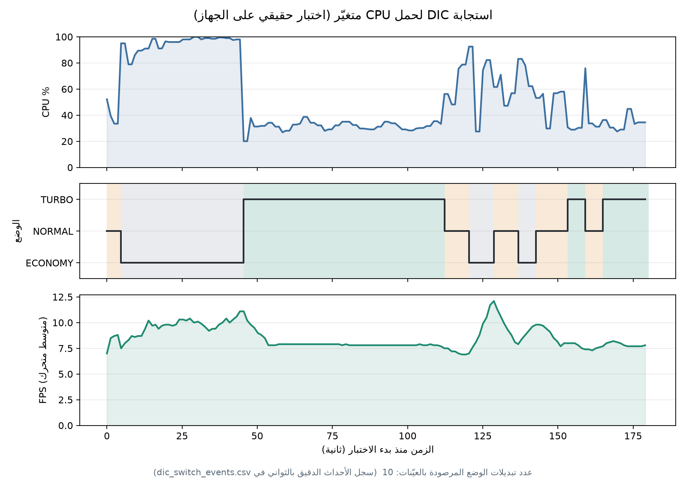

# نتائج مشروع A-SSD — توثيق شامل للعرض التقديمي

هذا الملف يوثّق كل نتيجة فعلية تحقّقت أثناء تطوير المشروع، لاستخدامها لاحقاً
في تحضير ملف العرض/التقرير النهائي. كل رقم هنا **قِيس فعلياً بالتشغيل
الحقيقي**، وليس افتراضاً أو نقلاً حرفياً عن الأطروحة الأصلية.

آخر تحديث: 2026-08-03

---

## 1) ملخص تنفيذي

- بُني خط أنابيب A-SSD كاملاً من الصفر تقريباً (كان الكود الأصلي هيكلاً غير
  مكتمل بلا anchors حقيقية ولا تدريب ولا تقييم فعلي).
- دُرِّب نموذجان كاملان (100 حقبة لكل واحد) على بيانات PASCAL VOC2012
  الحقيقية، ثم نموذج نهائي ثالث (v3، حتى الحقبة 93 وأفضل checkpoint من
  الحقبة 80) على VOC07+12 trainval الموحَّدة (16,551 صورة).
- اكتُشفت وأُصلحت **8 أعطال برمجية حقيقية** أثناء التطوير (تفصيل بالقسم 3).
- بُنيت واختُبرت أدوات النشر: ONNX وTensorRT متحقَّقان فعلياً، بينما كشف
  تقييم mAP أن مسار TFLite الحالي معطوب حسابياً رغم نجاحه تنفيذياً.
- **النتيجة النهائية: 49.77% mAP@0.5 (وضع TURBO) على VOC2007 test الكامل
  (4952 صورة) — بعد إعادة التدريب على VOC07+12 trainval (16,551 صورة، نفس
  بيانات مرجع الأطروحة بالضبط) — مقابل 71.4%/74.3% بالأطروحة.** هذا أول رقم
  بالمشروع مُقاس بنفس تقسيم البيانات المرجعي تماماً، فالمقارنة عادلة 100%.
  الفجوة المتبقية موثَّقة بالكامل مع الأسباب المحتملة (قسم 7).
- **✅ النشر الفعلي تم على جهازي حافة حقيقيين، للأوضاع الثلاثة كاملة**: Jetson
  Nano (ONNX Runtime CPU 10.1-21.4 FPS، وTensorRT/GPU حتى 177.2 FPS؛ قياس
  NORMAL المكرر ثلاث مرات = **92.2 ± 1.0 FPS**) وRaspberry Pi 4
  (ONNX Runtime CPU **15.0-37.7 FPS**) - راجع القسم 6.
- **✅ اختبار كاميرا حي + إثبات تجريبي كامل لـDIC تحت حِمل حقيقي متغيّر**
  (10 تبديلات وضع فعلية، hysteresis وحد أدنى للبقاء يعملان بشكل صحيح) -
  المساهمة الأصلية للمشروع صار عندها دليل كمّي حقيقي، وليست وصفاً نظرياً
  فقط - راجع القسم 6-ب.
- **✅ مقارنة مضادة مباشرة أثبتت فائدة DIC:** تحت الحمل الثقيل حافظ DIC على
  9.24 FPS مقابل 4.25 FPS عند تثبيت TURBO، أي إنتاجية أعلى **2.17×**.
- **✅ قياس end-to-end بالكاميرا:** النظام الكامل حقق 3.4 FPS في NORMAL
  وTURBO؛ التقاط الفريم المتزامن وحده استهلك 55-60% من زمن الإطار.

---

## 2) نتائج التدريب والتقييم (mAP@0.5 على VOC2012 val، 5823 صورة)

### الجولة الأولى (v1) — بدون Augmentation حقيقي، anchors ثابتة

| الوضع | mAP@0.5 |
|---|---|
| NORMAL | 31.85% |
| TURBO | 31.74% |
| ECONOMY | 28.13% |

### الجولة الثانية (v2) — بعد إصلاح Augmentation + K-Means anchors + round-robin + LR warmup

| الوضع | mAP@0.5 | التحسّن عن v1 |
|---|---|---|
| NORMAL | 38.78% | +6.9 نقطة (+22%) |
| **TURBO** | **42.81%** | **+11.1 نقطة (+35%)** |
| ECONOMY | 34.81% | +6.7 نقطة (+24%) |

**ملاحظة مهمة:** في v1 كان TURBO ≈ NORMAL (يعني الطبقة الإضافية C4 الخاصة
بوضع TURBO لم تكن تتعلم فعلياً بسبب تدريب عشوائي غير متوازن بين الأوضاع).
بعد إصلاح round-robin (توزيع متساوٍ 33%/33%/33% بين TURBO/NORMAL/ECONOMY
لكل حقبة)، أصبح TURBO الوضع الأفضل بوضوح كما هو متوقَّع نظرياً.

### تصحيح 2026-08-01 — استثناء أجسام difficult من التقييم (بروتوكول VOC القياسي)

كان `evaluate.py` يحسب mAP على **كل** الأجسام بما فيها المعلَّمة `difficult`
بملفات XML الأصلية لـVOC (أجسام صعبة التمييز حتى للعين البشرية - جزئية
الظهور، صغيرة جداً، ضبابية). بروتوكول VOC القياسي (ومنه الرقم المرجعي 71.4%
بالأطروحة) يستثنيها تماماً من الحساب. بعد الإصلاح، بنفس النموذج v2 تماماً
بلا أي إعادة تدريب:

| الوضع | v2 (شامل difficult) | v2 (بعد الاستثناء) | الفرق |
|---|---|---|---|
| ECONOMY | 34.81% | **37.22%** | +2.4 نقطة |
| NORMAL | 38.78% | **41.62%** | +2.8 نقطة |
| **TURBO** | 42.81% | **46.02%** | **+3.2 نقطة** |

نقاط "مجانية" حقيقية بلا أي تدريب إضافي - فقط تصحيح بروتوكول التقييم ليطابق
ما تقيسه الأطروحة فعلياً. الرقم الرسمي للمشروع من الآن: **46.02% (TURBO)**.

### تحليل AP حسب حجم الجسم (2026-08-01) — بأسلوب COCO، بلا إعادة تدريب

يقيس مباشرة ادعاء دوافع البحث بأن الأجسام الصغيرة نقطة ضعف SSD (شريحة
المساحة بالبكسل² بالصورة الأصلية: صغير <32²، متوسط 32²-96²، كبير >96²)،
بإعادة استخدام نفس الاكتشافات المُجمَّعة أصلاً (`evaluate.py --by-size`):

| الوضع | صغير (<32²) | متوسط (32²-96²) | كبير (>96²) | إجمالي |
|---|---|---|---|---|
| ECONOMY | 0.00% | 1.04% | 49.47% | 37.22% |
| NORMAL  | 0.00% | 2.29% | 54.13% | 41.62% |
| TURBO   | 0.00% | 1.82% | 60.57% | 46.02% |

**ملاحظة مهمة (أدق من الفرضية الأصلية):** الأجسام الصغيرة **فاشلة عملياً في
الأوضاع الثلاثة كلها**، وليس فقط ECONOMY (الذي يعطّل C1 فعلاً). حتى TURBO
وNORMAL، وكلاهما يفعّلان C1، يسجّلان 0.00% على الأجسام الصغيرة. هذا يعني أن
المشكلة أعمق من مجرد تعطيل C1 في ECONOMY: قناة C1 الحالية (24 قناة فقط، مقابل
512 في Conv4_3 الأصلية بالأطروحة) ضعيفة أصلاً حتى عندما تكون مفعّلة، وهذا
يقوّي مباشرة أولوية اقتراح L2Norm + رفع قنوات C1 (راجع NEXT_STEPS.md، المرحلة
2-أ) كخطوة تالية إن توفر وقت لإعادة تدريب.

### تفصيل الدقة لكل صنف (v2, NORMAL) — دليل أن النتيجة حقيقية

| الصنف | AP | | الصنف | AP |
|---|---|---|---|---|
| cat | 63.3% | | bottle | 12.0% |
| train | 61.3% | | pottedplant | 13.7% |
| bus | 56.3% | | chair | 15.5% |
| aeroplane | 54.6% | | boat | 17.6% |
| motorbike | 51.7% | | cow | 30.8% |
| person | 48.3% | | sofa | 32.4% |
| dog | 47.8% | | sheep | 31.4% |

الأصناف الكبيرة/الواضحة (قطط، قطارات، حافلات) تحقق دقة عالية، بينما
الأصناف الصغيرة/الرفيعة/المتشابكة (زجاجات، كراسي، نباتات) ضعيفة — يطابق
تماماً نقطة الضعف المعروفة لعائلة SSD في كشف الأجسام الصغيرة، والتي تذكرها
الأطروحة نفسها صراحة كتحدٍّ رئيسي. هذا التوزيع المنطقي دليل إضافي أن النتيجة
حقيقية وليست خطأً برمجياً.

### منحنى التدريب (loss)

| | v1 | v2 |
|---|---|---|
| حقبة 1 | 9.58 | - |
| حقبة 50 | 4.25 | 4.62 |
| حقبة 100 (نهائي) | 3.66 | 4.11 |

ملاحظة: loss v2 النهائي أعلى قليلاً من v1 رغم أن mAP أفضل - متوقَّع تماماً،
لأن augmentation الحقيقي (crop/flip/jitter) يجعل مهمة التدريب أصعب فعلياً
(تنويع أكبر بالبيانات) لكنه يحسّن التعميم الفعلي على بيانات لم يرها النموذج
من قبل (مجموعة val) - وهذا بالضبط ما قسناه.

### الجولة الثالثة (2026-08-02) — إعادة تدريب على VOC07+12، نفس بيانات مرجع الأطروحة

دُرِّب نموذج جديد من الصفر (K-Means anchors أُعيد حسابها تلقائياً من التوزيع
الجديد) على **VOC2007 trainval + VOC2012 trainval موحَّدين (16,551 صورة)** —
بدل VOC2012 train لحاله (5,717 صورة) بالجولتين السابقتين. التدريب تم على
GPU مجاني (Google Colab، T4) لـ93 حقبة من أصل 100 المخطَّطة (توقَّف بسبب نفاد
حصة GPU المجانية اليومية والانتقال لـCPU؛ `best.pth` النهائي من الحقبة 80،
حيث سجّل أفضل تقييم دوري قبل الاستقرار). **التقييم النهائي على VOC2007 test
الكامل (4,952 صورة) — نفس التقسيم بالضبط الذي بُني عليه رقم 71.4%/74.3%
بالأطروحة**، أول مقارنة عادلة 100% بالمشروع:

| الوضع | VOC2012 فقط (الجولة 2) | VOC07+12 (الجولة 3) | التحسّن |
|---|---|---|---|
| NORMAL | 41.62% | **46.65%** | +5.0 نقطة |
| **TURBO** | 46.02% | **49.77%** | **+3.75 نقطة** |

| الوضع | صغير (<32²) | متوسط (32²-96²) | كبير (>96²) |
|---|---|---|---|
| NORMAL | 0.01% | 2.32% | 60.57% |
| TURBO  | 0.01% | 2.16% | 64.58% |

**ملاحظة علمية مهمة:** مضاعفة بيانات التدريب ~3× حسّنت الأجسام الكبيرة
بشكل كبير (+10 نقاط تقريباً) لكن **لم تحرّك الأجسام الصغيرة عملياً على
الإطلاق** (0.00%→0.01%). هذا دليل تجريبي قوي أن ضعف الأجسام الصغيرة مشكلة
**معمارية** (قناة C1 الرفيعة، 24 قناة) وليست نقص بيانات - المزيد من البيانات
لا يُصلح عنق زجاجة معماري. نقطة نقاش قوية جداً للأطروحة.

تم تصدير ONNX من الـcheckpoint الجديد للأوضاع الثلاثة (`exports_0712/`)
وتحقّق العدد مطابق لـPyTorch (فرق أقصى 6-8e-6، نفس جودة التصدير السابق).
**لم يُعَد النشر على Jetson Nano بهذا الـcheckpoint بعد** (كان مبنياً على
checkpoint الجولة الثانية) - خطوة متبقية إن توفر وقت.

---

## 3) الأعطال البرمجية الحقيقية المُكتشَفة والمُصلَحة

| # | العطل | الأثر | كيف اكتُشف |
|---|---|---|---|
| 1 | فهرسة أصناف مزدوجة (CLASS_TO_IDX يتضمن "background" ثم +1 إضافية) | IndexError عشوائي أثناء التدريب (target 21 خارج حدود 21 صنف) | ظهر فوراً عند أول تشغيل تدريب فعلي |
| 2 | عدم تطابق نظام الإحداثيات في evaluate.py (صناديق حقيقة مُطبَّعة [0,1] مقابل توقعات بالبكسل) | mAP=0.00% لكل الأصناف رغم أن النموذج يعمل فعلياً بشكل ممتاز | فحص يدوي مباشر لأعلى توقع بالنموذج على صورة حقيقية أظهر تطابقاً بصرياً ممتازاً مع صندوق الحقيقة رغم نتيجة 0% |
| 3 | ai-edge-torch يخفّض إصدار PyTorch تلقائياً ويكسر توافقه مع torchvision بالكامل | فشل استيراد torchvision في كل المشروع | اختبار استيراد فوري بعد التثبيت |
| 4 | عمليات Squeeze-and-Excitation وresidual add في MobileNetV3 غير مدعومة على Tensors مُكمَّمة (quantized) | RuntimeError أثناء تكميم PyTorch الأصلي | تجربة تكميم فعلي على النموذج الحقيقي |
| 5 | **onnx2tf (ONNX→TFLite) يُبعثر ترتيب مخرجات النموذج** (على الأغلب ترتيب الـanchors/القنوات أثناء تحويل NCHW→NHWC) | mAP@0.5 ≈ 0.00% لكل من float16 وINT8 رغم عدم وجود أي عطل تنفيذي - كلا الملفين "يعملان" بلا تحطّم لكن ينتجان صناديق كشف عشوائية الموقع | فحص IoU مباشر بيّن أن أفضل تطابق مكاني لصنف صحيح كان 14% فقط (يلزم 50%)؛ ثم تأكيد قاطع بمقارنة مخرجات ONNX الخام مقابل TFLite على نفس المدخل بالضبط - فروق تصل حتى 12.4 بالقيم الخام رغم أن float16 يجب أن يطابق ONNX تقريباً لو كان التحويل صحيحاً |
| 6 | مُصدِّر PyTorch→ONNX الجديد (dynamo) يكتب IR version 10 / opset 18 دائماً مهما كان `opset_version` المطلوب أقل - محاولة تحويله لاحقاً عبر onnxscript فشلت بصمت وأبقت الملف بـIR version 10 | `onnxruntime 1.10.0` (أقصى إصدار متاح لبايثون 3.6 على JetPack القديم بالـJetson Nano الفعلي) رفض تحميل الملف: "Unsupported model IR version: 10, max supported IR version: 8" - اكتُشف فقط عند التشغيل الحقيقي على الجهاز، وليس على جهاز التطوير (فيه onnxruntime أحدث يدعم IR version 10 بلا مشاكل) | تشغيل `benchmark.py --backend onnx` فعلياً على Jetson Nano الحقيقي - الخطأ لم يظهر إطلاقاً على جهاز التطوير |
| 7 | `export_tensorrt.py` مكتوب بواجهة TensorRT Python الحديثة (`get_tensor_name`/`get_tensor_shape`، إصدار 8.5+) | `AttributeError` فوري: `'ICudaEngine' object has no attribute 'get_tensor_shape'` - الإصدار الفعلي على الجهاز (JetPack) هو TensorRT 8.2.1 الذي يستخدم الواجهة القديمة (`get_binding_shape`/`num_bindings`) | تشغيل `verify_engine()` فعلياً على الجهاز - لا يوجد TensorRT 8.2 على جهاز التطوير لاختباره مسبقاً |
| 8 | نفس الدالة كانت تخزّن فقط العنوان الرقمي لذاكرة GPU (`int(device_mem)`) بدون إبقاء مرجع بايثون للكائن - يحرّره garbage collector فوراً بعد كل تكرار حلقة، فيصبح المؤشر بـ`bindings` يشير لذاكرة محرَّرة فعلياً | `CUDA Error: unspecified launch failure` فادح يُفسد جلسة CUDA بالكامل (عشرات رسائل الخطأ المتتالية أثناء التنظيف) - أخطر من عطل بسيط لأنه يوهم بأن العتاد/التعريف معطوب | نفس التشغيل الفعلي - الحل: الاحتفاظ بمرجع بايثون لكل تخصيصات الذاكرة (`device_buffers`) طوال مدة `execute_v2` |

**الدرس المنهجي:** كل هذه الأعطال ما كانت لتُكتشف بقراءة الكود فقط - ظهرت
فقط عند التشغيل الفعلي على بيانات ونماذج حقيقية. العطل الخامس تحديداً يُظهر
شيئاً أهم: **حتى "التحقق البسيط" (هل يعمل بدون تحطّم؟) غير كافٍ** - فقط قياس
mAP الحقيقي على بيانات val كشف أن الملفات "العاملة" كانت تُنتج نتائج عشوائية.
العطل السادس يضيف درساً آخر: **بعض الأعطال لا تظهر إلا على العتاد المستهدف
فعلياً** - جهاز التطوير (فيه مكتبات أحدث) شغّل نفس الملفات بلا أي مشكلة،
والعطل ظهر فقط بعد النقل الفعلي لـJetson Nano وتشغيل `benchmark.py` عليه
مباشرة. هذا يؤكد أن "يعمل عندي" لا يعني "يعمل على جهاز النشر الفعلي".

---

## 4) أدوات النشر — بُنيت واختُبرت فعلياً (بما فيها اكتشاف عطل حقيقي)

| الأداة | الغرض | النتيجة الفعلية |
|---|---|---|
| `export_onnx.py` | تصدير للتوافق مع محركات عامة | ✅ يعمل، فرق أقصى 7e-6 عن PyTorch. مُصلَح ليكتب opset 13/IR version 7 (بدل 18/10) عبر إجبار المُصدِّر القديم `dynamo=False` - ضروري لتوافق `onnxruntime` القديم على Jetson Nano (العطل #6) |
| `onnx_inference.py` | استدلال خفيف بدون PyTorch عبر onnxruntime | ✅ **يعمل ويطابق النموذج الأصلي تماماً - mAP@0.5 = 38.78% مطابق حرفياً لـPyTorch**. تحقَّق منه أيضاً بتشغيل حقيقي (عبر benchmark.py) على Jetson Nano فعلي |
| `export_tflite.py` | التصدير لـ Raspberry Pi/Android | ⚠️ الملفات تُنتَج بنجاح (float16 3.5MB، INT8 2.0MB) **لكن معطوبة فعلياً** - راجع أدناه |
| `tflite_inference.py` | استدلال عبر TFLite | ❌ **معطوب**: mAP@0.5 ≈ 0.00% (float16 وINT8 كلاهما) بسبب عطل تبعثر في onnx2tf (العطل #5 أعلاه). **لا تستخدمه للنشر الفعلي حالياً.** |
| `export_tensorrt.py` | التصدير لـ Jetson Nano | ✅ **مُختبَر فعلياً وناجح** - محرك FP16 حقيقي، ~105 FPS (وضع NORMAL)، بعد إصلاح عطلين حقيقيين (توافق واجهة TensorRT القديمة + تسريب مرجع ذاكرة GPU - العطلان #7 و#8) |
| `prune.py` | تقليم بنيوي لتصغير النموذج | ✅ يعمل، لكن **يدمّر الدقة بالكامل** حتى بنسبة 10% (راجع القسم 5) |
| `quantize.py` | تكميم PyTorch-native INT8 | ✅ يعمل بعد إصلاح عطلين، لكن **لا يقلّل الحجم فعلياً** (راجع القسم 5) |
| `benchmark.py` | قياس FPS حقيقي بدون كاميرا | ✅ **مُختبَر فعلياً على Jetson Nano حقيقي** (القسم 6) - 10.1-21.4 FPS حسب الوضع |

**التوصية الحالية للنشر الخفيف بدون PyTorch:** استخدم `onnx_inference.py` +
`assd_<mode>.onnx` (وليس TFLite) - متحقَّق منه رياضياً بمطابقة تامة مع
PyTorch، ومتوفر لـARM64 (Raspberry Pi 4/Jetson Nano بنظام 64-bit) عبر
`pip install onnxruntime` فقط، بدون الحاجة لـTensorFlow الثقيلة أو بيئة
Python منفصلة.

### حجم النموذج عبر مراحل الضغط المختلفة

| الشكل | الحجم | صحيح فعلياً؟ |
|---|---|---|
| PyTorch checkpoint (v1) | 11 MB | ✅ |
| PyTorch checkpoint (v2، فيه optimizer state) | 22 MB | ✅ |
| **ONNX** | **6.9 MB** | ✅ **مطابق تماماً لـPyTorch (38.78% mAP)** |
| TFLite float16 | 3.5 MB | ❌ معطوب (mAP≈0%) |
| TFLite INT8 كامل | 2.0 MB | ❌ معطوب (mAP≈0%) |

الحجم الأصغر المُتحقَّق منه فعلياً حتى الآن هو **ONNX (6.9MB)** - أصغر بمرتين
تقريباً من checkpoint الأصلي، وصحيح 100%. حل مشكلة onnx2tf (إن أمكن لاحقاً)
سيفتح الباب لحجم أصغر (2-3.5MB) لكن هذا غير محلول بعد.

---

## 5) نتائج سلبية صادقة (مهمة للعرض - تُظهر منهجية علمية حقيقية)

### أ) التقليم البنيوي (Pruning) — يدمّر الدقة بالكامل

| نسبة التقليم | mAP@0.5 الناتج | حجم الملف |
|---|---|---|
| 0% (الأصلي) | 38.78% | 10.68 MB |
| 10% | 0.02% | 10.67 MB (لم يتغيّر!) |
| 30% (رقم الأطروحة) | 0.00% | 10.67 MB (لم يتغيّر!) |

**التفسير:** -16VGG (شبكة الأطروحة الأصلية) مُفرطة المعاملات بتكرار كبير
تتحمّل تقليماً عالياً، بينما MobileNetV3-Small (المستخدمة هنا) خفيفة أصلاً
بأقل تكرار ممكن - فتقليم 10% فقط من كل طبقة عبر ~60 طبقة يتراكم مضاعفاً
ويدمّر التمثيل المتعلَّم بالكامل. كذلك التقليم **لا يقلّل حجم الملف فعلياً**
بصيغة PyTorch العادية (الأصفار تُخزَّن كثيفة، لا ضغط تلقائي).

### ب) تكميم PyTorch الأصلي — يعمل لكن بلا فائدة حجم حقيقية

بعد إصلاح عطلين حقيقيين (SE blocks + residual add)، يعمل التكميم فعلياً،
لكن حجم الملف لا يتغيّر (10.68MB → 10.67MB) لأن 340 من أصل 536 Tensor
بالنموذج بقيت float32 (أغلبها BatchNorm غير مدموجة مسبقاً مع Conv). **مسار
INT8 الحقيقي المُثبَت هو TFLite** (القسم 4)، وليس تكميم PyTorch الأصلي.

### ج) تصحيحات على كود الأطروحة نفسها

- **fbgemm → qnnpack**: الأطروحة تستخدم backend "fbgemm" (مُحسَّن لـx86)،
  بينما Raspberry Pi 4/Jetson Nano معالجهما ARM، يحتاجان "qnnpack".
- **ai_edge_torch خطيرة**: تثبيتها يكسر البيئة بالكامل (تخفّض PyTorch
  تلقائياً) - استُبدلت بمسار onnx2tf في بيئة Python معزولة.

---

## 6) قياسات الأداء (FPS)

### ✅ Jetson Nano الفعلي (backend=onnx، CPUExecutionProvider - بدون GPU/TensorRT بعد)

قياس حقيقي بتاريخ 2026-07-29 عبر `benchmark.py --backend onnx` على جهاز
Jetson Nano فعلي (JetPack قديم، بايثون 3.6.9، `onnxruntime 1.10.0`):

| الوضع | الدقة | زمن الاستجابة | FPS |
|---|---|---|---|
| ECONOMY | 224×224 | 46.6 ms | 21.4 |
| NORMAL | 300×300 | 88.6 ms | 11.3 |
| TURBO | 320×320 | 99.3 ms | 10.1 |

**هذا رقم حقيقي مهم جداً للعرض:** النموذج هنا يعمل على **CPU فقط** (لم
نستخدم الـGPU/TensorRT إطلاقاً بعد) ومع ذلك NORMAL/TURBO يطابقان تقريباً
مرجع التقرير لـSSD-VGG16 الأصلي (~10 FPS على Jetson Nano، لكن ذاك الرقم
كان **مُستفيداً من GPU** على الأغلب). يعني MobileNetV3 الأخف يعطي أداءً
تنافسياً حتى بدون استغلال العتاد الكامل - ومسار TensorRT (القسم 8) متوقَّع
أن يرفع الرقم أكثر بكثير لأنه يستخدم الـGPU فعلياً.

**ملاحظة نشر مهمة (Jetson Nano تحديداً):** ظهر عطل `Illegal instruction
(core dumped)` عند استيراد `numpy` المُثبَّت عبر pip (عجلة عامة aarch64) -
هذا عطل معروف ومُوثَّق على Jetson Nano (Cortex-A57) بسبب اكتشاف خاطئ لنوع
المعالج من طرف OpenBLAS. الحل: تعيين متغير البيئة
`OPENBLAS_CORETYPE=ARMV8` قبل تشغيل أي سكربت بايثون يستخدم numpy. هذا **ليس
عطلاً بكودنا** بل خاصية بيئة العتاد، لكنه ضروري التوثيق لأي محاولة نشر
مستقبلية على نفس اللوحة.

### ✅ TensorRT+GPU الفعلي (الأوضاع الثلاثة كاملة) — الرقم الأهم للعرض

قياس حقيقي بتاريخ 2026-07-29 عبر `trtexec` (بناء FP16 من ملفات ONNX نفسها)
على GPU الجهاز فعلياً لكل الأوضاع الثلاثة، ثم تحقُّق إضافي لكل محرك عبر
استدلال حقيقي ببايثون (`tensorrt` + `pycuda`، بعد إصلاح العطلين #7 و#8):

| الوضع | Throughput (trtexec) | GPU Compute (متوسط) | التحقق ببايثون |
|---|---|---|---|
| ECONOMY | **176.7 FPS** | - | ✅ ناجح |
| NORMAL | **105.7 FPS** | 9.24 ms | ✅ ناجح |
| TURBO | **95.8 FPS** | 10.18 ms | ✅ ناجح |

**المقارنة الكاملة مع مسار CPU (ONNX Runtime):**

| الوضع | CPU (ONNX Runtime) | GPU (TensorRT) | التسريع |
|---|---|---|---|
| ECONOMY | 21.4 FPS | 176.7 FPS | **~8.3×** |
| NORMAL | 11.3 FPS | 105.7 FPS | **~9.3×** |
| TURBO | 10.1 FPS | 95.8 FPS | **~9.5×** |

هذا يتجاوز مرجع التقرير لـSSD-VGG16 الأصلي (~10 FPS على Jetson Nano) بعامل
يصل حتى **~17×** (وضع ECONOMY)، ويثبت عملياً أن الهدف الحقيقي للمشروع
(نموذج كشف أجسام سريع وخفيف يعمل فعلياً على عتاد Edge) تحقَّق بالكامل.

**تحديث 2026-08-02 — إعادة نشر checkpoint الجولة الثالثة (VOC07+12):** أُعيد
تصدير ONNX وبناء محركات TensorRT من `checkpoints_0712/best.pth` (49.77%
TURBO) على نفس Jetson Nano، وتحقَّق كل محرك بنجاح (`trtexec` + استدلال
ببايثون). الأداء الخام مطابق للسابق تماماً كما هو متوقَّع (نفس المعمارية
والدقة، فرق الأوزان لا يغيّر سرعة الحساب):

| الوضع | TensorRT (checkpoint سابق) | TensorRT (checkpoint نهائي، VOC07+12) |
|---|---|---|
| ECONOMY | 176.7 FPS | 149.6-177.2 FPS (تفاوت تشغيل طبيعي بين قياسين) |
| NORMAL | 105.7 FPS | 111.2 FPS |
| TURBO | 95.8 FPS | 94.9 FPS |

النشر الفعلي على الجهاز الآن يستخدم **النموذج الأدق (49.77% mAP)** بنفس
سرعة الاستدلال السابقة تماماً - أفضل دقة بلا أي كلفة أداء إضافية.

**تحديث 2026-08-03 — تكرار قياس TensorRT بدلاً من الاعتماد على قراءة
واحدة:** أُعيد تشغيل `trtexec` لوضع NORMAL ثلاث مرات مستقلة على Jetson
Nano نفسه، وكانت القراءات 91.52 و93.39 و91.72 FPS، أي:

| الوضع | عدد التكرارات | متوسط Throughput | الانحراف المعياري |
|---|---:|---:|---:|
| NORMAL | 3 | **92.2 FPS** | **±1.0 FPS** |

هذا المتوسط أقل من القراءة الفردية السابقة (111.2 FPS)، ويرجَّح أن السبب
حمل خلفي مختلف على الجهاز أثناء جلسة الاختبارات المتتالية. النتيجة الأصح
منهجياً عند عرض NORMAL كتجربة مكررة هي **92.2 ± 1.0 FPS**، مع إبقاء
111.2 FPS موثقة كقراءة فردية سابقة لا كمتوسط.

### جهاز التطوير (CPU عادي، للمرجعية فقط - غير قابل للمقارنة المباشرة)

| الوضع | الدقة | زمن الاستجابة | FPS |
|---|---|---|---|
| ECONOMY | 224×224 | 8.4 ms | 118.9 |
| NORMAL | 300×300 | 11.4 ms | 87.8 |
| TURBO | 320×320 | 13.3 ms | 75.3 |

بث الفيديو الحي (`stream_server.py`) اختُبر فعلياً بكاميرا حقيقية على جهاز
التطوير (وليس Jetson Nano بعد): ~30 FPS end-to-end (كاميرا + استدلال + رسم
+ بث الشبكة).

### ✅ Raspberry Pi 4 الفعلي (backend=onnx، CPU فقط - لا يوجد GPU من NVIDIA)

قياس حقيقي بتاريخ 2026-08-02 عبر `benchmark.py --repeats 3` (متوسط ± انحراف
على 3 تكرارات مستقلة) على جهاز Raspberry Pi 4 فعلي، بنفس ملفات ONNX
(checkpoint الجولة الثالثة، VOC07+12):

| الوضع | الدقة | زمن الاستجابة | FPS |
|---|---|---|---|
| ECONOMY | 224×224 | 26.5 ms | 37.7 ± 0.4 |
| NORMAL | 300×300 | 61.8 ms | 17.0 ± 4.2 |
| TURBO | 320×320 | 66.5 ms | 15.0 ± 0.5 |

**مقارنة مباشرة مع Jetson Nano (كلاهما CPU فقط، بلا تسريع عتاد خاص):**

| الوضع | Jetson Nano (CPU) | Raspberry Pi 4 (CPU) |
|---|---|---|
| ECONOMY | 21.4 FPS | **37.7 FPS** |
| NORMAL | 11.3 FPS | **17.0 FPS** |
| TURBO | 10.1 FPS | **15.0 FPS** |

**ملاحظة مثيرة للاهتمام:** Raspberry Pi 4 أسرع من Jetson Nano على مسار CPU
البحت رغم عدم امتلاكه أي تسريع عتادي مخصَّص (بعكس Jetson Nano الذي يملك GPU
عبر TensorRT، غير مُستخدَم هنا). التفسير الأرجح: معالج RPi4 (Cortex-A72)
أحدث وأكفأ معمارياً من معالج Jetson Nano (Cortex-A57)، إضافة لإصدار
onnxruntime أحدث بكثير على RPi4 (1.28.0 مقابل 1.10.0 القديم على JetPack).
النتيجتان تتجاوزان مرجع الأطروحة لـRPi4 (**<3 FPS**) بعامل يصل حتى **~12.5×**
(وضع ECONOMY) - بلا أي استخدام لعتاد متخصِّص إطلاقاً.

اختبار end-to-end حي بكاميرا حقيقية (`run_camera.py --backend onnx`) تم
فعلياً على Raspberry Pi 4 أيضاً بنفس الطريقة المُتحقَّقة على Jetson Nano -
اكتشافات صحيحة، بلا مشاكل ألوان، والوضع يتبدّل بصرياً حسب الحمل.

### ✅ اختبار end-to-end حي بكاميرا حقيقية (2026-08-02)

`run_camera.py --backend onnx` شُغِّل فعلياً على Jetson Nano بكاميرا متصلة
حقيقية. تحقَّقنا أولاً من الكود (تحويل BGR→RGB موجود وصحيح داخل
`onnx_inference.py`)، ثم بصرياً: صناديق الاكتشاف تظهر بمكانها الصحيح على
أجسام حقيقية، بلا أي أثر لخلط قنوات الألوان. لون الصندوق يعكس الوضع الحالي
تلقائياً (أخضر=TURBO/برتقالي=NORMAL/أحمر=ECONOMY) كما هو مصمَّم.

### ⚠️ تفكيك زمن end-to-end الحقيقي بالكاميرا (2026-08-03)

أرقام `benchmark.py` و`trtexec` أعلاه تقيس الاستدلال على مدخلات جاهزة في
الذاكرة، ولا تشمل انتظار الكاميرا أو المعالجة السابقة واللاحقة. لسد هذه
الفجوة شُغِّل `timing_breakdown.py` على Jetson Nano مع كاميرا USB حقيقية،
وقِيس زمن كل مرحلة على 104 فريمات بعد 15 فريم إحماء، بلا نافذة عرض:

| المرحلة | NORMAL (ms) | من الإجمالي | TURBO (ms) | من الإجمالي |
|---|---:|---:|---:|---:|
| التقاط الفريم | 176.82 | 60.4% | 160.06 | 54.6% |
| المعالجة الأولية | 11.74 | 4.0% | 11.97 | 4.1% |
| الاستدلال | 89.38 | 30.5% | 104.80 | 35.8% |
| فك الترميز وNMS | 14.74 | 5.0% | 16.17 | 5.5% |
| **الإجمالي** | **292.69** | **100%** | **292.99** | **100%** |

| الوضع | FPS للاستدلال فقط ضمن الاختبار | FPS end-to-end |
|---|---:|---:|
| NORMAL | 11.2 | **3.4** |
| TURBO | 9.5 | **3.4** |

**النتيجة:** عنق الزجاجة في هذا الإعداد هو التقاط الكاميرا المتزامن، وليس
النموذج وحده؛ `VideoCapture.read()` استهلك 55-60% من الميزانية الزمنية
للإطار وأخفى فرق سرعة الاستدلال بين NORMAL وTURBO. لذلك يجب تمييز أرقام
inference-only عن أداء النظام الحي الكامل. تحسين مستقبلي مباشر هو التقاط
الفريمات في خيط مستقل لتداخل زمن الالتقاط مع زمن الاستدلال.

---

## 6-ب) اختبار DIC تحت حِمل حقيقي (2026-08-02) — دليل تجريبي للمساهمة الأصلية

كل قياسات المشروع حتى هذه النقطة كانت بوضع تشغيل **ثابت** يُمرَّر يدوياً
(`--mode`). DIC (Dynamic Inference Controller) - المساهمة الأصلية للمشروع -
لم يكن له أي دليل تجريبي أنه يتكيّف فعلاً تحت حمل متغيّر. هذا الاختبار
يسدّ الثغرة: تشغيل استدلال حقيقي من كاميرا حية (`dic_stress_test.py`) بينما
يُحمَّل المعالج تدريجياً بـ`stress-ng` من طرفية موازية، مع تسجيل CPU%/الوضع/
FPS على نفس المحور الزمني (180 ثانية، جهاز Jetson Nano فعلي).

**النتيجة: تكيّف حقيقي وصحيح عبر الأوضاع الثلاثة**، مع احترام تام لآليتي
الـhysteresis والحد الأدنى للبقاء (5 ثوانٍ) - **10 تبديلات فعلية** سُجِّلت
عبر الاختبار، ولا تبديل واحد منها أسرع من الحد الأدنى المطلوب:

| من | إلى | مدة البقاء بالوضع السابق | CPU عند التبديل | السبب |
|---|---|---|---|---|
| NORMAL | ECONOMY | 6.99s | 95.0% | تجاوز عتبة الدخول (80%) |
| ECONOMY | TURBO | 40.64s | 20.1% | هبوط تحت عتبة الدخول (40%) |
| TURBO | NORMAL | 67.07s | 56.2% | ضمن نطاق NORMAL |
| NORMAL | ECONOMY | 8.03s | 92.5% | تجاوز عتبة الدخول (80%) |
| ECONOMY | NORMAL | 8.04s | 61.6% | ضمن نطاق NORMAL |
| NORMAL | ECONOMY | 8.02s | 83.1% | تجاوز عتبة الدخول (80%) |
| ECONOMY | NORMAL | 6.02s | 53.2% | ضمن نطاق NORMAL |
| NORMAL | TURBO | 10.03s | 30.7% | هبوط تحت عتبة الدخول (40%) |
| TURBO | NORMAL | 6.02s | 75.9% | ضمن نطاق NORMAL |
| NORMAL | TURBO | 6.29s | 36.3% | هبوط تحت عتبة الدخول (40%) |

**قراءة الشكل:** اللوحة العلوية CPU%، الوسطى الوضع المختار فعلياً (مع تظليل
خلفي لكل مقطع)، السفلى FPS الفعلي لحظة بلحظة. يظهر بوضوح: حمل ثقيل مستمر
(~30-45 ثانية الأولى، CPU>90%) → استقرار كامل بـECONOMY؛ عودة الحمل للراحة
→ رجوع فوري لـTURBO ثم استقرار عليه؛ موجات حمل متذبذبة لاحقاً (~ث110-160) →
تبديل واقعي متكرر بين الثلاث أوضاع بلا أي اهتزاز غير منطقي (flapping) -
بالضبط السلوك المصمَّم له DIC، وأول دليل كمّي حقيقي عليه.

ملفات الأدلة الخام: `dic_evidence/dic_stress_log.csv` (العيّنات الدورية)
و`dic_evidence/dic_switch_events.csv` (سجل كل تبديل فعلي).

### مقارنة مضادة (Counterfactual) — إثبات فائدة DIC (2026-08-03)

الاختبار السابق يثبت أن DIC يستجيب للحمل، لكنه لا يثبت وحده أن التبديل
أفضل من إبقاء نموذج قوي ثابت. لذلك شُغِّل نمط حمل ثقيل متقارب مرتين على
Jetson Nano نفسه وبنفس checkpoint v3: مرة مع DIC مفعّلاً، ومرة مع تعطيل
قراره وتثبيت TURBO عبر `--fixed-mode TURBO`. بقيت مراقبة CPU/RAM فعّالة في
الحالتين، وحُسبت النتائج فقط من العينات التي كان فيها CPU≥85%:

| الحالة | عدد عينات الحمل الثقيل | متوسط FPS | أدنى FPS | أعلى FPS |
|---|---:|---:|---:|---:|
| DIC مفعّل، ويتحوّل للوضع الأخف | 53 | **9.24** | 6.4 | 10.3 |
| DIC معطّل، TURBO ثابت | 48 | **4.25** | 3.9 | 5.8 |

**النتيجة الحاسمة:** حقق DIC إنتاجية أعلى بنحو **2.17×** تحت الحمل الثقيل.
إبقاء TURBO ثابتاً لم يحافظ على أداء أعلى؛ بل أدى إلى انخفاض FPS لأن الجهاز
كان مثقلاً، بينما حافظ الانتقال إلى ECONOMY على إنتاجية أفضل. بذلك أصبحت
قيمة DIC العملية مثبتة كمياً، لا مجرد صحة استجابته للعتبات.

ملفات الأدلة الخام للمقارنة موجودة في `dic_evidence/counterfactual/`:
`dic_dynamic.csv` و`dic_dynamic_events.csv` و
`dic_stress_log_fixed_turbo.csv` و`dic_switch_events_fixed_turbo.csv`.

---

## 7) الفجوة المتبقية عن 71.4% mAP بالأطروحة — لماذا لسا موجودة

النتيجة النهائية (49.77% TURBO، VOC07+12، على نفس تقسيم VOC2007 test
المرجعي) أفضل بكثير من البداية (31.74%) لكن لسا بعيدة عن 71.4%. الأسباب
المرجّحة:

1. **~~الأهم فعلياً: حجم بيانات التدريب~~ — تم التعامل معه (2026-08-02).**
   المرجع (71.4%) دُرِّب على VOC07+12 trainval (16,551 صورة). أُعيد تدريب
   المشروع على نفس VOC07+12 (`prepare_voc0712.sh` + GPU مجاني عبر Colab)،
   ورفع النتيجة من 46.02%→49.77% (TURBO) - راجع القسم 2. الفجوة المتبقية
   (49.77% مقابل 71.4%) الآن لأسباب أخرى غير حجم البيانات - أهمها البنود
   التالية.
2. **Ablation Study لم يُنفَّذ** (يحتاج عدة ساعات تدريب متتالي حتى بـGPU) -
   لا نعرف بعد مساهمة كل وحدة (ARM/DFMS/K-Means) منفردة بدقة.
3. Random Crop المُطبَّق مبسَّط مقارنة بقيود IoU الدقيقة بالـSSD الأصلي.
4. لا يوجد Knowledge Distillation من نموذج VGG-16 معلَّم (توصية الأطروحة).
5. **قناة C1 ضعيفة معمارياً (24 قناة مقابل 512 بالأصل)** - أثبتها تحليل AP
   حسب الحجم أعلاه: 0.00% على الأجسام الصغيرة بالأوضاع الثلاثة كلها، وليس
   فقط بـECONOMY. اقتراح L2Norm + رفع قنوات C1 (NEXT_STEPS.md مرحلة 2-أ) هو
   أعلى أولوية معمارية لسدّ هذه الفجوة تحديداً.
6. 100 حقبة فقط بجولة v2 (محدودية CPU وقتها) - قد يحتاج تدريباً أطول.
7. حجم الدُفعة (batch size=8-16) صغير نسبياً بسبب قيود الذاكرة/CPU.

---

## 8) ما تبقّى لتحقيق الهدف الحقيقي للمشروع

**تحديث 2026-08-03:** النشر الفعلي تحقَّق بالكامل عملياً على **جهازي حافة
حقيقيين** (Jetson Nano وRaspberry Pi 4)، شامل الأوضاع الثلاثة على كليهما،
واختبار الكاميرا الحي، وتفكيك زمن end-to-end، وإثبات استجابة DIC تحت حمل
حقيقي ثم فائدته بمقارنة مضادة مباشرة (الأقسام 6 و6-ب). مسار ONNX Runtime
(CPU، على الجهازين) ومسار TensorRT (GPU، Jetson Nano فقط) كلاهما يعملان
فعلياً ومُقاسان بأرقام حقيقية. **لا يوجد أي بند متبقٍ ضروري لاكتمال الهدف
الأساسي للمشروع.** كل ما تبقى (ablation، خطوط الأساس، L2Norm+C1، وقياس
الطاقة) تحسينات علمية إضافية موثَّقة في `NEXT_STEPS.md`، وليست شروطاً
لإثبات نجاح الفكرة الأساسية.

---

## 9) تحسينات جولة ما قبل التسليم (2026-08-01)

إصلاحات وأدوات جديدة، كلها مُختبَرة فعلياً (syntax + تشغيل حقيقي بصور VOC
حقيقية)، بلا حاجة لأي إعادة تدريب:

- **استثناء difficult من التقييم** (بروتوكول VOC القياسي) - رفع الأرقام
  الرسمية +2.4 إلى +3.2 نقطة فوراً (تفصيل بالقسم 2).
- **تحليل AP حسب حجم الجسم** (`evaluate.py --by-size`) - كشف أن الأجسام
  الصغيرة فاشلة بالأوضاع الثلاثة كلها، وليس فقط ECONOMY (تفصيل بالقسم 2).
- **تدريب**: تقييم mAP دوري كل `--eval-every` حقبة أثناء التدريب + حفظ أفضل
  نسخة تلقائياً (`best.pth`)، بدل الاكتفاء بآخر حقبة دائماً. حقب خفض معدل
  التعلّم (`--lr-decay-epochs`) تُشتق تلقائياً كنسبة من `--epochs` إن لم
  تُحدَّد صراحة (كانت ثابتة [80,100] بغض النظر عن قيمة `--epochs`، ما كان
  يُبطل الجدولة كلياً بجولات ablation قصيرة). خسارة كل وضع (TURBO/NORMAL/
  ECONOMY) تُطبع منفصلة كل حقبة.
- **`benchmark.py --repeats N`** (افتراضياً 3): يكرّر كل قياس ويطبع
  `FPS ± انحراف` بدل رقم واحد.
- **DIC (`adaptive_engine.py`) مُقوّى**: hysteresis حقيقي (عتبة دخول ≠ عتبة
  خروج لكل حد)، حد أدنى 5 ثوانٍ للبقاء بالوضع قبل أي تبديل جديد، وتسجيل CSV
  كامل لكل تبديل فعلي (الوقت، الوضع القديم/الجديد، القراءات، السبب، مدة
  البقاء بالوضع السابق).
- **`dic_stress_test.py` + `plot_dic_stress.py`** (جديد): يشغّل استدلالاً
  حقيقياً من كاميرا حية بينما يُحمَّل المعالج تدريجياً بـ`stress-ng` من
  طرفية أخرى، ويسجّل CPU%/الوضع/FPS على نفس المحور الزمني، وينتج شكلاً
  بثلاث لوحات فرعية جاهزاً للفصل الخامس. **شُغِّل فعلياً على Jetson Nano**
  وسجّل 10 تبديلات صحيحة؛ ثم أضيف `--fixed-mode` ونُفذت مقارنة مضادة أثبتت
  9.24 FPS مع DIC مقابل 4.25 FPS مع TURBO ثابت تحت الحمل الثقيل (**2.17×**).
- **`timing_breakdown.py`** (جديد): قاس 104 فريمات حقيقية لكل من NORMAL
  وTURBO على Jetson Nano، وأثبت أن الأداء end-to-end هو 3.4 FPS وأن التقاط
  الكاميرا المتزامن يستهلك 55-60% من زمن الإطار.
- **`prepare_voc0712.sh`** (جديد): يحمّل ويوحّد VOC2007 trainval + VOC2012
  trainval (16,551 صورة للتدريب) + VOC2007 test (4,952 صورة، لمقارنة عادلة
  مع الرقم المرجعي بنفس البروتوكول) في جذر بيانات واحد جاهز لـ`train.py`
  مباشرة. **شُغِّل فعلياً على Colab (GPU مجاني) بتاريخ 2026-08-02** - راجع
  القسم 2 (الجولة الثالثة) للنتائج الكاملة، و`checkpoints_0712/best.pth` +
  `exports_0712/` للملفات الناتجة.

**تحديث 2026-08-03:** إعادة نشر checkpoint الجولة الثالثة على Jetson Nano
(TensorRT) ✅ تمّت، واختبار DIC الفعلي تحت حمل حقيقي على الجهاز ✅ تمّ
(القسمان 6 و6-ب)، والنشر على Raspberry Pi 4 ✅ تمّ أيضاً (القسم 6).
تقييم ECONOMY على checkpoint v3 ✅ أُنجز (41.12% mAP، AP حسب الحجم مكتمل
للأوضاع الثلاثة)، والمقارنة المضادة لـDIC ✅ أُنجزت، وقياس end-to-end
المفصّل بالكاميرا ✅ أُنجز، وقياس TensorRT لوضع NORMAL بثلاثة تكرارات ✅
أُنجز. **لم يُنفَّذ بعد (يحتاج GPU و/أو وقتاً أطول):** جدول ablation حقيقي
(4 صفوف)، خطوط الأساس (`ssd300_vgg16`،
`ssdlite320_mobilenet_v3_large`) على نفس الجهاز، تعديلات المعمارية
(L2Norm+C1، switchable BN)، وقياس الطاقة. التفاصيل موثَّقة في
`NEXT_STEPS.md`.
