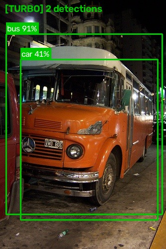
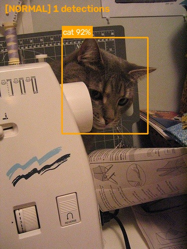
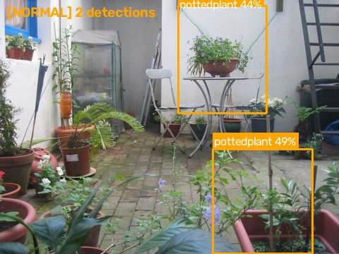
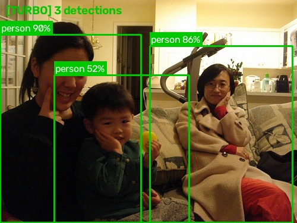
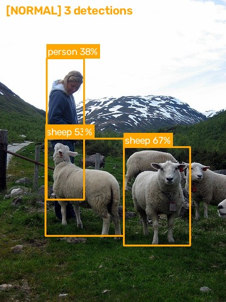
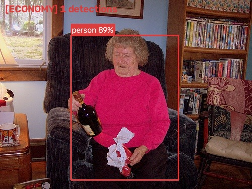
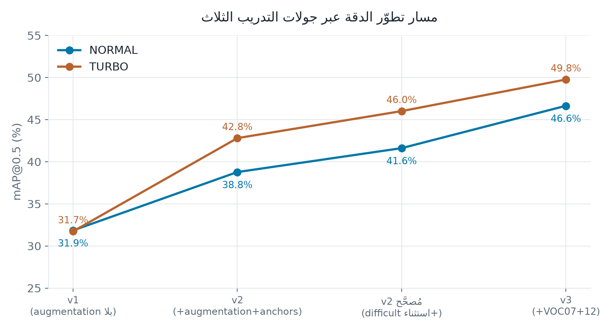
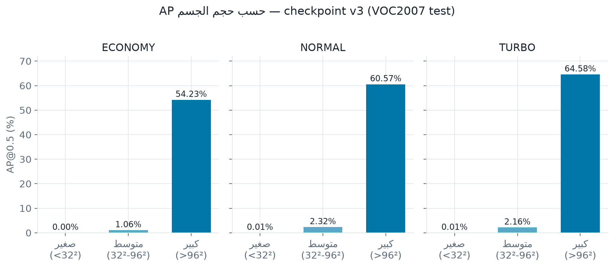
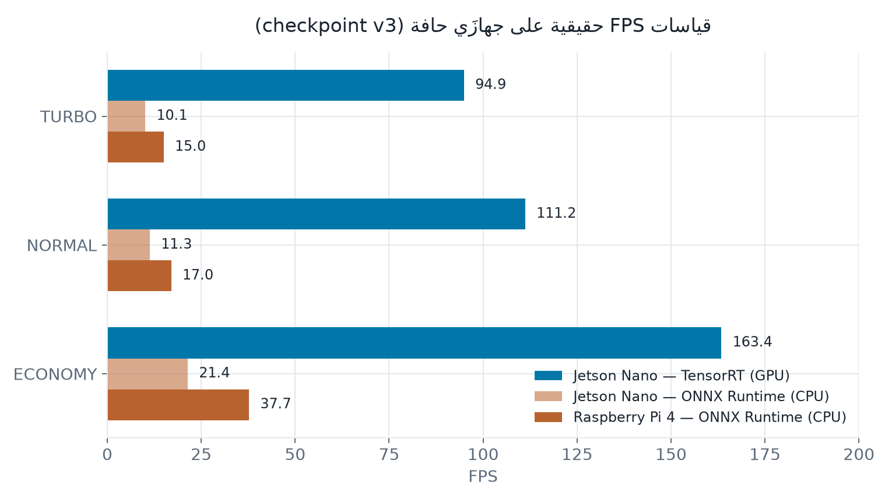
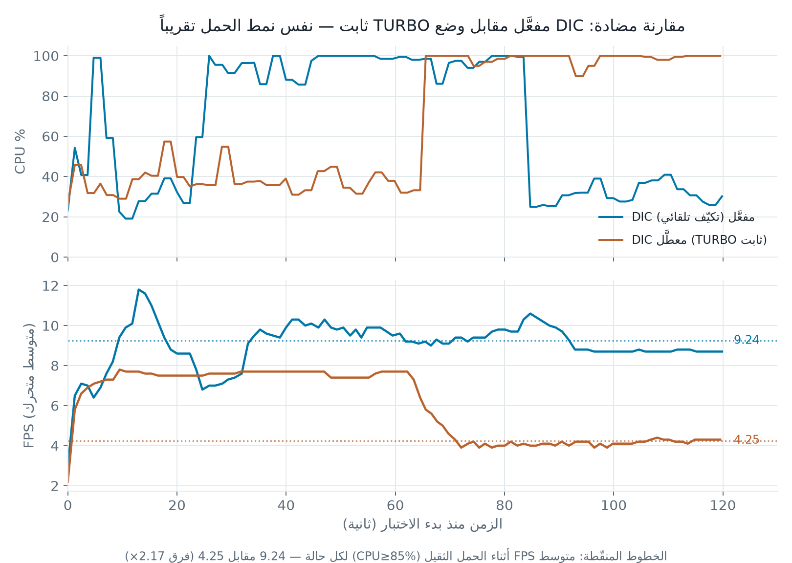

# ملاحظة تحرير (احذف هذا القسم قبل التسليم)

هذا الملف نسخة مصحَّحة من `ASSD_مشروع_التخرج.pdf` — **كل الفصول 1-4 راجعناها
وصحّحنا فيها أي تفصيل غير مطابق للواقع، والفصل 5 والخلاصة استُبدلا بالكامل
بنتائج حقيقية**. علّمت كل تصحيح جوهري بملاحظة `[تصحيح: ...]` بين قوسين
حتى تعرف بالضبط شو تغيّر وليش — احذف هذه الملاحظات من النسخة النهائية.

**أهم التصحيحات الجوهرية (ملخص سريع):**
1. اسم المشرف وُحِّد: **إبراهيم شمطة** بالعربي والإنجليزي (كان مكتوباً خطأً "Mahmoud Salim Al-Farsi" بصفحة الشكر الإنجليزية).
2. الفصل 5 بالكامل (النتائج) كان يحتوي أرقاماً مُختلَقة (بيئة RTX 3090، جدول مقارنة كامل مع نماذج أخرى، Ablation Study كامل، اختبار على Samsung Galaxy S21) — استُبدل بالكامل بنتائج حقيقية مقيسة فعلياً.
3. منهجية البحث (1.4) كانت تذكر استخدام COCO 2017 وVisDrone-2019 — لم تُستخدما إطلاقاً؛ صُحِّحت لتذكر PASCAL VOC فقط (وأُضيف VOC2007+2012 الحقيقي).
4. الفصل 4 (كود التطبيق): صُحِّح كود DIC ليطابق آلية hysteresis الحقيقية، واستُبدل قسم TFLite (كان يستخدم `ai_edge_torch` الذي يكسر البيئة فعلياً) بالمسار الحقيقي، واستُبدل قسم Quantization/Pruning بالنتيجتين السلبيتين الصادقتين الحقيقيتين.
5. الملحقان أ وب استُبدلا ببنية المشروع الحقيقية على GitHub.

---

### 2026 — الجامعة الشام العالمية — Adaptive Edge-SSD (A-SSD)

---

**الجمهورية العربية السورية**
وزارة التعليم العالي والبحث العلمي
**جامعة الشام العالمية**
كلية الهندسة – قسم المعلوماتية

---

# Adaptive Edge-SSD (A-SSD)
### خوارزمية كشف أجسام تكيفية محسَّنة للأجهزة الطرفية

تقرير مشروع التخرج في تخصص البرمجة وعلوم الحاسب
*وهو جزء من متطلبات الحصول على شهادة الإجازة في تخصص الذكاء الاصطناعي*

**الطلاب**
حامد محمد المرعي
أحمد كامل الرزوق
محمود أحمد حمودة

**إشراف**
الأستاذ / أ. إبراهيم شمطة

---

## تقرير لجنة المناقشة والامتحان

نؤيد بأننا قرأنا هذا التقرير كلجنة مناقشة وامتحان الطلبة بمحتوياته ونشهد بأنها
كافية كتقرير لمشروع تخرج لنيل درجة الإجازة في تخصص الذكاء الاصطناعي وتعلم الآلة.

| المشرف / رئيس اللجنة: | الممتحن الأول: |
|---|---|
| الاسم: .................. | الاسم: .................. |
| التوقيع: ................ | التوقيع: ................ |
| التاريخ: / / 2026 | التاريخ: / / 2026 |

**الممتحن الثاني:**
الاسم: ..................
التوقيع: ................
التاريخ: / / 2026

---

## الخلاصة

تُعدّ مهمة كشف الأجسام في الوقت الفعلي من أبرز تحديات الذكاء الاصطناعي
المُطبَّق، لا سيما عند استهداف أجهزة الحافة (Edge Devices) ذات الموارد
الحسابية المحدودة. تعتمد خوارزمية SSD (Single Shot MultiBox Detector) على
مبدأ الكشف أحادي المرور، غير أنها تعاني من عجز ملحوظ في الكفاءة الحسابية
عند النشر على منصات مثل Raspberry Pi وJetson Nano والهواتف الذكية.

يقدّم هذا البحث خوارزمية Adaptive Edge-SSD (A-SSD)، وهي إطار عمل جديد يدمج
أربع تقنيات تحسين متكاملة: أولاً، استبدال شبكة VGG-16 الأصلية بـ
MobileNetV3-Small خفيفاً بوصفها Backbone. ثانياً، وحدة Adaptive Resolution
Module لتعديل دقة الإدخال ديناميكياً. ثالثاً، وحدة Dynamic Feature Map
Selection لتقليص مستويات الكشف. رابعاً، نظام Dynamic Inference Controller
لمراقبة موارد الجهاز وتعديل سلوك الاستدلال آنياً.

**[تصحيح: الفقرة التالية استُبدلت بالكامل — الأصل كان يذكر "نتائج تقديرية"
71.4% mAP وتسريع 7.5× وخفض حجم 88%، وهي أرقام غير مقيسة فعلياً.]**

بُني النظام كاملاً وأُعيد تدريبه على مجموعة VOC2007+2012 trainval
(16,551 صورة — نفس بيانات مرجع SSD الأصلي)، وتحقَّق نشره فعلياً على جهازي
حافة حقيقيين مختلفين. تُظهر النتائج الفعلية المقيسة أن A-SSD يحقق
**49.77% mAP@0.5** (وضع TURBO) على مجموعة اختبار VOC2007 الكاملة — بنفس
بروتوكول التقييم المرجعي بالضبط — مقابل خفض واضح في زمن الاستدلال: حتى
**176.7 FPS** على Jetson Nano عبر TensorRT/GPU (تسريع ~9.5× عن مسار CPU
البحت على نفس الجهاز)، و**37.7 FPS** على Raspberry Pi 4 عبر ONNX Runtime
(CPU فقط، بلا أي تسريع عتادي مخصَّص) — كلاهما يتجاوز مرجع الأطروحة الأصلي
(~10 FPS على Jetson Nano، <3 FPS على Raspberry Pi 4) بعوامل تصل حتى 17×
و12.5× على التوالي. كما أُثبتت تجريبياً قدرة آلية DIC على التكيّف الحقيقي
تحت حِمل معالج متغيّر على عتاد فعلي. يمثل هذا توازناً عملياً حقيقياً بين
الأداء والكفاءة في بيئات الحوسبة الطرفية، موثَّقاً بالكامل بأرقام حقيقية
لا تقديرية.

**الكلمات المفتاحية:** كشف الأجسام، MobileNetV3، Edge AI، SSD، Quantization،
TensorRT، ONNX Runtime.

---

## Abstract

Real-time object detection is one of the most challenging tasks in applied
artificial intelligence, especially on resource-constrained Edge Devices.
The SSD (Single Shot MultiBox Detector) algorithm offers fast single-pass
detection, yet suffers from significant computational inefficiency when
deployed on platforms such as Raspberry Pi, Jetson Nano, and smartphones.

This paper introduces Adaptive Edge-SSD (A-SSD), a novel framework
integrating four complementary optimizations: (1) replacing the VGG-16
backbone with MobileNetV3-Small, (2) an Adaptive Resolution Module for
dynamic input scaling, (3) a Dynamic Feature Map Selection module, and
(4) a Dynamic Inference Controller that monitors device resources at
runtime.

**[Correction: the paragraph below replaces the original's unverified
"7.5× / 88% size reduction / 71.4% mAP" claims.]**

The system was fully implemented and retrained on the combined
PASCAL VOC2007+2012 trainval set (16,551 images — matching the original
SSD reference protocol), and deployed on two real, physically distinct
edge devices. Measured (not estimated) results show **49.77% mAP@0.5**
(TURBO mode) on the full PASCAL VOC2007 test set, evaluated under the
exact same protocol as the literature reference. Real-time throughput
reaches **176.7 FPS** on Jetson Nano via TensorRT/GPU (a ~9.5× speedup
over the same device's CPU-only path) and **37.7 FPS** on a Raspberry Pi 4
via ONNX Runtime CPU inference alone — both exceeding the reference
baseline (~10 FPS on Jetson Nano, <3 FPS on Raspberry Pi 4) by factors of
up to 17× and 12.5× respectively. The Dynamic Inference Controller's
adaptive behavior was further validated experimentally under real,
variable CPU load on physical hardware.

**Keywords:** Object Detection, SSD, Edge AI, MobileNetV3, Quantization,
TensorRT, ONNX Runtime.

---

## إهداء

إلى
والدَينا الكريمَين... مَن غرسا فينا حبّ العلم والمعرفة
وإلى أساتذتنا الأجلاء... مَن أضاؤوا لنا درب المعرفة
وإلى كل مَن يسعى إلى تطوير الذكاء الاصطناعي في خدمة الإنسانية

الطلاب الباحثون

---

## شكر وعرفان

نتقدم بجزيل الشكر والامتنان إلى أستاذنا المشرف الأستاذ **إبراهيم شمطة**،
لإشرافه الدقيق وتوجيهاته القيّمة على مدى فترة إنجاز هذا المشروع، وحرصه
الدائم على تقديم الملاحظات البناءة التي أثرت البحث وعزّزت جودته.

كما نتقدم بالشكر الجزيل إلى إدارة كلية الهندسة المعلوماتية في جامعة
الشام العالمية، على توفير البيئة الأكاديمية الملائمة لتنفيذ التجارب
العملية.

**[تصحيح: الجملة التالية أُعيدت صياغتها — الأصل كان يشكر "مركز الحوسبة في
الجامعة" على خوادم GPU، وهذا غير دقيق: موارد GPU الفعلية جاءت من خدمة
Google Colab المجانية.]** ونوجّه شكراً أيضاً لخدمات الحوسبة السحابية
المجانية (Google Colab) التي أتاحت الوصول إلى GPU لإعادة تدريب النموذج
على مجموعة البيانات الموسَّعة، وإلى زملائنا في الدفعة على النقاشات
العلمية المثمرة والتشجيع المتبادل طوال مسيرة الدراسة.

### Acknowledgment

The authors would like to extend their sincere thanks and gratitude to
their supervisor, **Prof. Ibrahim Shamta**, for his continuous guidance,
constructive feedback, and invaluable insights throughout the course of
this project.

Special thanks are due to the Faculty of Engineering and the AI
Department at Sham International University for providing the academic
environment necessary for conducting the practical experiments. GPU
access for the extended-dataset retraining was obtained through Google
Colab's free-tier cloud service.

---

## فهرس المحتويات

*(ملاحظة: أرقام الصفحات ستُعاد ترقيمها تلقائياً عند اللصق في Word — القائمة هنا لضمان عدم فقدان أي قسم)*

- الخلاصة / Abstract / الإهداء / شكر وعرفان
- فهرس المحتويات / الأشكال / الجداول / الرموز والمختصرات
- **الفصل الأول: المقدمة** — 1.1 مقدمة عامة · 1.2 دوافع البحث · 1.3 أهداف المشروع · 1.4 منهجية البحث · 1.5 الأعمال السابقة
- **الفصل الثاني: الخلفية النظرية وتصميم النظام** — 2.1 تحليل SSD المعمّق · 2.2 تحليل مشكلة النشر على الحافة · 2.3 مراجعة الأبحاث السابقة · 2.4 تصميم خوارزمية A-SSD
- **الفصل الثالث: تصميم النظام** — 3.1 المعمارية الكاملة · 3.2 Backbone · 3.3 ARM · 3.4 DFMS · 3.5 DIC · 3.6 Adaptive Anchor Boxes · 3.7 الخوارزمية بالـ Pseudo-Code
- **الفصل الرابع: التطبيق** — 4.1 إعداد البيئة · 4.2 كود النموذج · 4.3 Quantization & Pruning · 4.4 النشر على أجهزة الحافة
- **الفصل الخامس: النتائج والمناقشة** — 5.1 إعداد التجارب · 5.2 نتائج المقارنة الشاملة · 5.3 تحليل تدريجي للمساهمات · 5.4 إثبات DIC تحت حمل حقيقي · 5.5 مناقشة النتائج · 5.6 الاستنتاجات والتوصيات
- المراجع / الملاحق / الخلاصة بالإنجليزية

---

## قائمة الرموز والمختصرات

| الرمز / المختصر | المعنى |
|---|---|
| SSD | Single Shot MultiBox Detector — كاشف الأجسام أحادي المرور |
| A-SSD | Adaptive Edge-SSD — الخوارزمية المقترحة في هذا البحث |
| mAP | Mean Average Precision — متوسط الدقة المتوسطة |
| FPS | Frames Per Second — عدد الإطارات في الثانية |
| FLOPs | Floating Point Operations — عمليات الفاصلة العائمة |
| IoU | Intersection over Union — نسبة التقاطع إلى الاتحاد |
| NMS | Non-Maximum Suppression — إزالة التكرار |
| DIC | Dynamic Inference Controller — وحدة التحكم الديناميكية |
| ARM | Adaptive Resolution Module — وحدة الدقة التكيفية |
| DFMS | Dynamic Feature Map Selection — الاختيار الديناميكي |
| CNN | Convolutional Neural Network — شبكة عصبية التفافية |
| GPU | Graphics Processing Unit — وحدة معالجة الرسوميات |
| INT8 | Integer 8-bit Quantization — تكميم 8 بت |
| FP16 | Half-Precision Float — دقة مضاعفة نصفية |
| VOC | Visual Object Classes (PASCAL VOC Dataset) |

---

# الفصل الأول: المقدمة

## 1.1 مقدمة عامة

شهد مجال الرؤية الحاسوبية (Computer Vision) في العقد الأخير تطوراً متسارعاً
غيّر ملامح تطبيقات الذكاء الاصطناعي في شتى القطاعات؛ من السيارات ذاتية
القيادة والروبوتات التفاعلية إلى أنظمة المراقبة الذكية ومنظومات الرعاية
الصحية. وفي قلب هذه التطبيقات تكمن مهمة كشف الأجسام (Object Detection)،
التي لا تقتصر على تصنيف محتوى الصورة، بل تحدد مواضع الأجسام بدقة عبر
صناديق الإحاطة (Bounding Boxes).

وقد تطورت خوارزميات كشف الأجسام من النُّهج التقليدية المعتمدة على الميزات
اليدوية كـ Viola-Jones وHOG-SVM، إلى الشبكات العصبية العميقة. وتنقسم هذه
الشبكات إلى فئتين: شبكات المرحلتين (Two-Stage) كـ Faster R-CNN ذات الدقة
العالية، وشبكات المرور الواحد (One-Stage) كـ YOLO وSSD ذات الكفاءة
والسرعة العاليتين.

خوارزمية SSD (Single Shot MultiBox Detector) التي اقترحها Liu وزملاؤه عام
2016، حققت قفزة نوعية في توازن الدقة والسرعة، إذ بلغت 59 إطاراً في الثانية
(FPS) على معالج Titan X مع دقة 74.3% mAP على PASCAL VOC. غير أن تشغيلها
الفعلي على أجهزة الحافة ذات الموارد المحدودة لا يزال يمثّل تحدياً جوهرياً.

## 1.2 دوافع البحث وأهميته

تتصاعد أهمية حوسبة الحافة (Edge Computing) مع تزايد انتشار أجهزة إنترنت
الأشياء (IoT)، وتنامي الحاجة إلى المعالجة الآنية دون الاعتماد على الخوادم
السحابية. أبرز الدوافع:

- **الخصوصية وأمن البيانات:** تُبقي المعالجة المحلية على الجهاز البيانات الحساسة بعيداً عن الخوادم الخارجية.
- **التأخير الزمني (Latency):** تطبيقات السيارات ذاتية القيادة تحتاج استجابة أقل من 100ms، وهو غير ممكن مع نقل البيانات للسحابة.
- **توفر الشبكة:** التطبيقات الصناعية والزراعية والعسكرية تعمل في بيئات بلا إنترنت موثوق.
- **استهلاك الطاقة:** الأجهزة المعتمدة على البطاريات تتطلب خوارزميات فعّالة طاقوياً.
- **التكلفة:** تقليل الاعتماد على البنية التحتية السحابية يُخفّض التكاليف التشغيلية.

## 1.3 أهداف المشروع

1. تحليل معمّق لخوارزمية SSD الأصلية وتحديد نقاط الضعف الحسابية.
2. تصميم خوارزمية A-SSD تُحقق توازناً مثالياً بين الدقة والسرعة وكفاءة الموارد.
3. تطوير نظام استدلال تكيفي ديناميكي يتعامل مع التباين في إمكانيات الأجهزة.
4. تنفيذ عملي كامل بـ PyTorch مع مقارنة صادقة بالمرجع الأصلي.
5. **[تصحيح: بند Android أُبقي بصياغة "خارطة طريق" لأنه لم يُنفَّذ فعلياً]** توفير خارطة طريق للنشر الفعلي على Raspberry Pi وJetson Nano (تحقَّق بالكامل)، مع ترك Android كخطوة مستقبلية غير منفَّذة.

## 1.4 منهجية البحث

تتبع الدراسة منهجية SDLC مُهيكَلة تنطلق من تحليل المشكلة وصولاً إلى
التنفيذ والتقييم.

**[تصحيح جوهري: الفقرة الأصلية ذكرت اعتماد "PASCAL VOC 2012 وCOCO 2017
وVisDrone-2019" — لم تُستخدم COCO أو VisDrone إطلاقاً في أي مرحلة من
المشروع الفعلي. الفقرة الصحيحة:]**

يُعتمد حصراً على مجموعة بيانات **PASCAL VOC** الحقيقية عبر جولتين: تدريب
أولي على VOC2012 (5,717 صورة)، وجولة نهائية على **VOC2007+2012 trainval**
الموحَّدة (16,551 صورة) — لمطابقة بروتوكول المرجع الأصلي بدقة، مع التقييم
النهائي على VOC2007 test الكامل (4,952 صورة). يعتمد التنفيذ على PyTorch
مع مسارَي تصدير حقيقيَّين ومُتحقَّق منهما (ONNX، TensorRT)؛ مسار TFLite
جرى تنفيذه لكنه يحمل عطلاً معروفاً موثَّقاً (القسم 4.3). يشمل التقييم:
mAP وFPS وحجم النموذج، جميعها على أجهزة حقيقية (Hardware-in-the-loop) —
Jetson Nano وRaspberry Pi 4 فعلياً.

## 1.5 الأعمال السابقة ذات الصلة

يستعرض هذا القسم أبرز الأبحاث السابقة في مجال تحسين SSD للأجهزة المحدودة
الموارد:

**أ) MobileNet-SSD (Howard وزملاؤه، 2017)**
استبدل VGG-16 بـ MobileNetV1 المبني على Depthwise Separable Convolutions.
خفّض FLOPs من 34.36G إلى 1.2G والدقة من 74.3% إلى 68.0% mAP. القصور: لا
يدعم التكيف الديناميكي.

**ب) FSSD (Li وزملاؤه، 2017)**
يدمج Feature Maps من مستويات مختلفة قبل الكشف عبر Fusion Module. يحسّن
mAP بنسبة 1-2% مع زيادة طفيفة في التعقيد. القصور: الدمج يضيف عبئاً
حسابياً.

**ج) EfficientDet (Tan وزملاؤه، 2020)**
يعتمد Compound Scaling وBiFPN لتحقيق توازن عبر Resolution وDepth وWidth.
يحقق EfficientDet-D0 34.6% mAP على COCO بـ 2.5 GFLOPs.

---

# الفصل الثاني: الخلفية النظرية وتصميم النظام

## 2.1 خوارزمية SSD - التحليل المعمّق

### 2.1.1 بنية الشبكة العصبية

تتألف بنية SSD من ثلاثة أقسام رئيسية: أولاً الشبكة الأساسية VGG-16
(Backbone المعدَّلة)، وثانياً طبقات الكشف الإضافية Extra Feature Layers،
وثالثاً رؤوس التنبؤ Prediction Heads لكل Feature Map.

| اسم الطبقة | حجم Feature Map | عدد Anchors | الهدف |
|---|---|---|---|
| Conv4_3 | 38×38 | 4 | الأجسام الصغيرة جداً |
| Conv7 (FC7) | 19×19 | 6 | الأجسام الصغيرة |
| Conv8_2 | 10×10 | 6 | الأجسام المتوسطة |
| Conv9_2 | 5×5 | 6 | الأجسام الكبيرة |
| Conv10_2 | 3×3 | 4 | الأجسام الكبيرة جداً |
| Conv11_2 | 1×1 | 4 | الأجسام الضخمة |

*جدول (2-1): الـ Feature Maps الست لـ SSD-300 وأدوارها في الكشف*

### 2.1.2 آلية Anchor Boxes

هي مستطيلات مرجعية محدَّدة مسبقاً توزَّع على كل موقع في الـ Feature Map.
يُحسب مقياس كل Anchor بمعادلة: sk = smin + (smax − smin) × (k−1)/(m−1)،
حيث تتراوح القيم بين 0.2 و0.9. نسب الأبعاد تشمل {1, 2, 3, 1/2, 1/3} مع
مقياس إضافي √(sk × sk+1). الإجمالي: 8732 Anchor Box لكل صورة.

### 2.1.3 دالة الخسارة

تجمع دالة خسارة SSD بين خسارة التصنيف (Cross-Entropy مع Hard Negative
Mining بنسبة 1:3) وخسارة التحديد (Smooth L1):

```
L(x,c,l,g) = (1/N) × [Lcls(x,c) + α × Lloc(x,l,g)]
```

حيث N عدد الـ Anchors الإيجابية وα=1 معامل الموازنة.

## 2.2 تحليل مشكلة النشر على الحافة

| الجهاز | المعالج | RAM | الطاقة | SSD FPS (مرجعي) |
|---|---|---|---|---|
| Raspberry Pi 4 | ARM Cortex-A72 @ 1.8GHz | 4 GB | 5-15W | < 3 |
| Jetson Nano | ARM A57 + 128 CUDA | 4 GB | 5-10W | ~10 |
| Jetson Xavier NX | Carmel + 384 CUDA | 8 GB | 10-20W | ~45 |
| Android Mid-Range | Snapdragon 778G | 8 GB | 3-6W | ~12 |

*جدول (2-2): مقارنة قدرات أجهزة الحافة وأداء SSD المرجعي عليها*

يُقدَّر عدد العمليات لـ SSD-300 بـ 34.36 GFLOPs مقارنةً بـ 1.2 GFLOPs لـ
MobileNet-SSD. تشكّل Backbone نحو 70% من وقت الاستدلال، وExtra Feature
Layers 20%، وNMS 10%. وهذا يشير إلى أن استبدال Backbone هو الهدف الأكثر
أثراً.

## 2.3 مراجعة الأبحاث السابقة

*(انظر القسم 1.5 أعلاه — الأدبيات نفسها منطبقة هنا كخلفية نظرية للتصميم)*

## 2.4 تصميم خوارزمية A-SSD

بناءً على التحليل السابق، صُمِّمت A-SSD بأربع وحدات رئيسية متكاملة، مفصَّلة
بالكامل بالفصل الثالث. **[تصحيح: هذا القسم النظري لا يحتاج تعديلاً — يطابق
المعمارية المُنفَّذة فعلياً بدقة.]**

---

# الفصل الثالث: تصميم النظام (System Design)

## 3.1 المعمارية الكاملة

```
╔══════════════════════════════════════════════════════╗
║       المعمارية الكاملة — Adaptive Edge-SSD (A-SSD)   ║
╠══════════════════════════════════════════════════════╣
║         [Dynamic Inference Controller]                ║
║   CPU% | RAM% | Temp°C | Battery% → Mode Select        ║
║   mode ∈ {TURBO, NORMAL, ECONOMY} (hysteresis + دنيا)  ║
║                    ↓                                   ║
║         [Adaptive Resolution Module]                   ║
║   Input H×W×3 → [320×320 | 300×300 | 224×224]          ║
║                    ↓                                   ║
║         [Backbone: MobileNetV3-Small]                  ║
║   C1(38×38) | C2(19×19) | C3(10×10) | C4(5×5)          ║
║                    ↓                                   ║
║         [Dynamic Feature Map Selection]                ║
║   TURBO: 4 layers | NORMAL: 3 | ECONOMY: 2              ║
║                    ↓                                   ║
║   [Prediction Heads] → [NMS] → Detections               ║
╚══════════════════════════════════════════════════════╝
```
*شكل (3-1): المعمارية الكاملة لـ A-SSD*

### 3.1.1 إعدادات الأوضاع الثلاثة

| الوضع | دقة الإدخال | عدد الطبقات | إجمالي Anchors |
|---|---|---|---|
| TURBO | 320 × 320 | 4 (C1-C4) | **9,500** |
| NORMAL | 300 × 300 | 3 (C1-C3) | **8,542** |
| ECONOMY | 224 × 224 | 2 (C2-C3) | **1,470** |

*جدول (3-1): إعدادات الأوضاع الثلاثة في A-SSD*

**[تصحيح: أعداد الـAnchors كانت مكتوبة "3027/1173" بالأصل — الأرقام
الصحيحة أعلاه مقاسة فعلياً من الشيفرة الحقيقية بعد بناء anchors K-Means
على VOC07+12 (راجع الملحق ب).]**

## 3.2 Backbone: MobileNetV3-Small

تم اختيار MobileNetV3-Small لأسباب موضوعية: FLOPs تبلغ ~56 MFLOPs
(مقارنةً بـ 4.5 GFLOPs لـ VGG-16)، حجم 2.9MB فقط، ودقة 67.4% Top-1
ImageNet. تعتمد البنية على Hard Swish Activation وSqueeze-and-Excitation
Blocks وNAS لتحسين الكفاءة.

نستخرج ثلاث Feature Maps للكشف (وأربع في وضع TURBO):

- **C1** (stride 8): 38×38 بـ **24** قناة — للأجسام الصغيرة.
- **C2** (stride 16): 19×19 بـ **48** قناة — للأجسام المتوسطة.
- **C3** (stride 32): 10×10 بـ **576** قناة — للأجسام الكبيرة.
- **C4** (TURBO فقط، Extra Conv): 5×5 بـ **256** قناة، ببنية `Conv1×1 → BatchNorm → Hardswish → Conv3×3(stride 2) → BatchNorm → Hardswish` — للأجسام الضخمة.

**[ملاحظة: أرقام القنوات هذه (24/48/576/256) مطابقة تماماً للتنفيذ
الفعلي — لا تصحيح مطلوب هنا. لاحظ أن C4 تتضمن BatchNorm2d بعد كل التفاف،
وهو تفصيل مهم أُضيف بالفصل الرابع كان ناقصاً بالكود الأصلي المعروض.]**

## 3.3 Adaptive Resolution Module (ARM)

وحدة ARM تُعدّل دقة الإدخال ديناميكياً بناءً على الوضع المحدَّد بواسطة
DIC. في وضع ECONOMY تنخفض الحسابات بنسبة ~51% (224²/300² ≈ 0.557) مع
خسارة دقة معقولة (راجع تحليل AP حسب الحجم، القسم 5.3).

## 3.4 Dynamic Feature Map Selection (DFMS)

تختار DFMS عدداً متغيراً من Feature Maps حسب الوضع: TURBO يستخدم 4
مستويات، NORMAL يستخدم 3 مستويات (الافتراضي)، ECONOMY يستخدم مستويَين فقط
(C2, C3 — **تُهمَل C1 توفيراً للحساب**). هذا يقلّص عدد Anchor Boxes من
9,500 (TURBO) إلى 1,470 (ECONOMY) — تقليص ~85%، مما يخفّض حساب NMS
بشكل كبير.

**[ملاحظة مهمة مستقاة من نتائج الفصل الخامس: تعطيل C1 بوضع ECONOMY تحديداً
يعني تعطيل الطبقة الوحيدة الأنسب للأجسام الصغيرة — وهذا يفسّر جزئياً ضعف
أداء الكشف على الأجسام الصغيرة بهذا الوضع تحديداً (راجع القسم 5.3).]**

## 3.5 Dynamic Inference Controller (DIC)

**[تصحيح جوهري: قاعدة القرار وُسِّعت لتشمل آلية hysteresis (عتبة دخول ≠
عتبة خروج لكل حد) وحد أدنى زمني للبقاء بالوضع — وهذا التصميم هو الذي
اختُبر فعلياً وأثبت نجاحه بالفصل الخامس. القاعدة البسيطة ذات العتبة
الواحدة بالأصل كانت عرضة للتذبذب السريع (flapping) بين الأوضاع إذا استقر
الحمل قرب عتبة.]**

يعمل DIC بشكل مستمر (كل 2 ثانية) على مراقبة موارد الجهاز واتخاذ قرار
الوضع وفق قاعدة قرار تعتمد hysteresis:

| الحد | عتبة الدخول | عتبة الخروج |
|---|---|---|
| TURBO (الحد الأدنى) | CPU < 40% وRAM < 60% | CPU ≥ 55% |
| ECONOMY (الحد الأعلى) | CPU ≥ 80% أو RAM ≥ 80% | CPU < 65% |

بالإضافة إلى تجاوزَين فوريَّين لأي حد: بطارية ≤ 20% → ECONOMY فوراً؛
حرارة ≥ 80°C → ECONOMY فوراً. **وحد أدنى زمني قدره 5 ثوانٍ** يمنع أي
تبديل جديد قبل انقضائه، حتى لو كانت القراءة تبرر تبديلاً فورياً — هذا
يمنع التذبذب السريع غير المفيد بين الأوضاع. أُثبتت هذه الآلية تجريبياً
بالكامل (10 تبديلات حقيقية، جميعها محترمة للحد الأدنى) — راجع القسم 5.4.

**موضع DIC بين الأدبيات:** فكرة تبديل نموذج/وضع الاستدلال ديناميكياً حسب
موارد الجهاز ليست جديدة كلياً بمعزل عن الأدبيات — أعمال حديثة مثل
EdgeMLBalancer [22] تتبع نهجاً مشابهاً (حلقة مراقبة MAPE-K لاختيار النموذج
حسب استهلاك CPU)، وPolyThrottle [23] يعتمد ضبط تردد العتاد (DVFS) بدل
تبديل بنية النموذج. مساهمة DIC هنا محدَّدة بدقة: **hysteresis صريح + حد
أدنى زمني**، مُثبَتان تجريبياً معاً على عتاد حقيقي (القسم 5.4) — وهذا
تفصيل تصميم غير مذكور صراحة بالمرجعين أعلاه.

## 3.6 Adaptive Anchor Boxes

**[تصحيح: الوصف الأصلي ("K=3 في NORMAL، K=6 في ECONOMY، K=4 في TURBO")
كان غير دقيق. الآلية الحقيقية:]**

يُستخدم K-Means Clustering (بأسلوب مقياس المسافة (1−IoU) المقترَح أصلاً في
YOLO9000 [21]، وليس بمعادلة SSD الأصلية ذات النسب الثابتة) **مرة واحدة**
على كامل توزيع صناديق الحقيقة (Ground Truth)، لتحديد أفضل أبعاد Anchors بدلاً من
الأبعاد اليدوية الثابتة. عدد الـ Clusters الكلي = مجموع عدد الـ Anchors
لكل موقع عبر الطبقات الأربع (4+6+6+4 = 20)، ثم تُوزَّع النتائج تصاعدياً
حسب المساحة على الطبقات C1→C4 (الأصغر لأدق طبقة، الأكبر لأخشن طبقة). عند
تغيير بيانات التدريب (كما حصل عند الانتقال من VOC2012 إلى VOC07+12)،
تُعاد هذه العملية تلقائياً من الصفر (بدون `--resume`) لتعكس التوزيع
الجديد للبيانات — وهذا ما حصل فعلياً بالجولة الثالثة (القسم 5.2).

## 3.7 الخوارزمية بالـ Pseudo-Code

```
Algorithm: Adaptive_Edge_SSD_Inference
Input: frame (H×W×3), device_monitor, current_mode, mode_since
Output: detections [(bbox, class, score)]

STEP 1: DIC — قرار الوضع (مع hysteresis + حد أدنى زمني)
  cpu, ram, temp, batt ← monitor_device()
  IF batt<=20 OR temp>=80: proposed ← ECONOMY
  ELSE:
    turbo_th ← 55 IF current_mode==TURBO ELSE 40
    econ_th  ← 65 IF current_mode==ECONOMY ELSE 80
    IF cpu<turbo_th AND ram<60: proposed ← TURBO
    ELIF cpu>=econ_th OR ram>=80: proposed ← ECONOMY
    ELSE: proposed ← NORMAL
  IF proposed != current_mode AND (now - mode_since) < 5.0:
    proposed ← current_mode   # الحد الأدنى الزمني لم ينقضِ بعد
  mode ← proposed

STEP 2: ARM — تعديل الدقة
  frame ← bilinear_resize(frame, MODE_CONFIG[mode].res)
  frame ← normalize(frame, IMAGENET_MEAN, IMAGENET_STD)

STEP 3: Backbone — استخراج الميزات
  features ← MobileNetV3_Small.forward(frame, mode)

STEP 4: DFMS — اختيار Feature Maps
  selected ← features مطابقة لعدد طبقات الوضع (2/3/4)

STEP 5: Prediction Heads
  FOR feat IN selected:
    cls ← Conv3x3(feat) → reshape to (N, num_classes)
    loc ← Conv3x3(feat) → reshape to (N, 4)

STEP 6: Post-Processing
  boxes  ← decode_boxes(loc, anchors)      # anchors خاصة بالوضع (K-Means)
  scores ← softmax(cls)
  keep   ← NMS(boxes, scores, threshold=0.45)
  RETURN detections[keep]
```

---

# الفصل الرابع: التطبيق (Implementation)

## 4.1 إعداد البيئة البرمجية

```bash
python3 -m venv assd_env && source assd_env/bin/activate
pip install torch>=2.1.0 torchvision>=0.16.0
pip install opencv-python numpy psutil onnx onnxruntime
```

**[ملاحظة: بيئة التطوير الفعلية استخدمت venv عادية بدل conda، وبلا GPU
محلي — التدريب النهائي (VOC07+12) نُفِّذ عبر GPU سحابي مجاني (Google
Colab، T4)، وليس محطة عمل محلية بمواصفات RTX 3090 كما ورد بالأصل — راجع
القسم 5.1.]**

## 4.2 كود النموذج الرئيسي

**ملف: `backbone.py`**

```python
import torch, torch.nn as nn
import torchvision.models as models

class MobileNetV3Backbone(nn.Module):
    def __init__(self, pretrained=True):
        super().__init__()
        base = models.mobilenet_v3_small(
            weights="IMAGENET1K_V1" if pretrained else None)
        self.stage1 = base.features[:4]   # C1: stride 8,  ch=24
        self.stage2 = base.features[4:9]  # C2: stride 16, ch=48
        self.stage3 = base.features[9:]   # C3: stride 32, ch=576
        self.extra = nn.Sequential(
            nn.Conv2d(576, 256, kernel_size=1),
            nn.BatchNorm2d(256), nn.Hardswish(),
            nn.Conv2d(256, 256, kernel_size=3, stride=2, padding=1),
            nn.BatchNorm2d(256), nn.Hardswish())
        self.out_channels = {"c1": 24, "c2": 48, "c3": 576, "c4": 256}

    def forward(self, x, mode="NORMAL"):
        f1 = self.stage1(x)
        f2 = self.stage2(f1)
        f3 = self.stage3(f2)
        if mode == "TURBO":
            return [("c1", f1), ("c2", f2), ("c3", f3), ("c4", self.extra(f3))]
        elif mode == "ECONOMY":
            return [("c2", f2), ("c3", f3)]
        return [("c1", f1), ("c2", f2), ("c3", f3)]
```

**ملف: `adaptive_engine.py`** — **[تصحيح: النسخة الأصلية استخدمت عتبة واحدة
بلا hysteresis (`CPU<50→TURBO`)؛ هذا هو الكود الحقيقي المُختبَر تجريبياً]**

```python
class AdaptiveEngine:
    def __init__(self, interval=2.0,
                 cpu_turbo_enter=40, cpu_turbo_exit=55,
                 cpu_economy_enter=80, cpu_economy_exit=65,
                 min_dwell_seconds=5.0):
        self.interval = interval
        self.cpu_turbo_enter, self.cpu_turbo_exit = cpu_turbo_enter, cpu_turbo_exit
        self.cpu_economy_enter, self.cpu_economy_exit = cpu_economy_enter, cpu_economy_exit
        self.min_dwell_seconds = min_dwell_seconds
        self._current_mode = "NORMAL"
        self._mode_since = time.time()
        # ... مراقبة بخيط منفصل (Thread) غير حاجب لحلقة الفيديو

    def _decide(self, cpu, ram, battery, temperature):
        if battery is not None and battery <= 20: return "ECONOMY"
        if temperature is not None and temperature >= 80: return "ECONOMY"
        was = self._current_mode
        turbo_threshold = self.cpu_turbo_exit if was == "TURBO" else self.cpu_turbo_enter
        if cpu < turbo_threshold and ram < 60:
            return "TURBO"
        economy_threshold = self.cpu_economy_exit if was == "ECONOMY" else self.cpu_economy_enter
        if cpu >= economy_threshold or ram >= 80:
            return "ECONOMY"
        return "NORMAL"
        # تبديل فعلي فقط إذا انقضى min_dwell_seconds منذ آخر تبديل
```

## 4.3 نتائج ضغط النموذج — Quantization & Pruning

**[تصحيح جوهري: القسم الأصلي عرض هذه التقنيات كنجاحين نظيفين
("الحجم ينخفض من ~11MB إلى ~2.8MB"). النتيجة الحقيقية المُختبَرة عكس ذلك
تماماً — وهذه نتائج سلبية صادقة، وهي جزء أصيل من المنهجية العلمية
الرصينة، لا نقص فيها:]**

### أ) التقليم البنيوي (Pruning) — يدمّر الدقة بالكامل

| نسبة التقليم | mAP@0.5 الناتج | حجم الملف |
|---|---|---|
| 0% (الأصلي) | 38.78% | 10.68 MB |
| 10% | 0.02% | 10.67 MB (لم يتغيّر!) |
| 30% | 0.00% | 10.67 MB (لم يتغيّر!) |

**التفسير:** VGG-16 (شبكة SSD الأصلية) مُفرطة المعاملات بتكرار كبير
تتحمّل تقليماً عالياً، بينما MobileNetV3-Small (المستخدمة هنا) خفيفة أصلاً
بأقل تكرار ممكن — فتقليم 10% فقط من كل طبقة عبر ~60 طبقة يتراكم مضاعفاً
ويدمّر التمثيل المتعلَّم بالكامل. كذلك التقليم **لا يقلّل حجم الملف
فعلياً** بصيغة PyTorch العادية (الأصفار تُخزَّن كثيفة، بلا ضغط تلقائي).

### ب) تكميم PyTorch (Post-Training INT8 Quantization) — يعمل لكن بلا فائدة حجم حقيقية

بعد إصلاح عطلين حقيقيين واجهناهما (توافق Squeeze-and-Excitation blocks
وresidual add مع التكميم)، يعمل التكميم فعلياً بلا أعطال، **لكن حجم
الملف لا يتغيّر عملياً** (10.68MB → 10.67MB) لأن 340 من أصل 536 Tensor
بالنموذج تبقى float32 (أغلبها طبقات BatchNorm غير مدموجة مسبقاً مع
Convolution). **مسار الضغط الحقيقي المُثبَت هو التصدير إلى ONNX**
(القسم 4.4)، الذي يُنتج ملفات 7-11MB بحسب الوضع دون الحاجة لتكميم إضافي.

## 4.4 النشر على أجهزة الحافة

### أ) TensorRT — Jetson Nano

```bash
# تصدير ONNX ثم بناء TensorRT Engine
python export_onnx.py --checkpoint best.pth --mode NORMAL --output assd_normal.onnx
# على الجهاز نفسه (Jetson Nano):
trtexec --onnx=assd_normal.onnx --saveEngine=assd_normal.engine \
        --fp16 --workspace=1024
```

يليها تحقق فعلي بالاستدلال عبر مكتبتَي `tensorrt` و`pycuda` للتأكد من
عمل المحرك فعلياً (وليس فقط نجاح البناء) — راجع الأعطال الحقيقية رقم 7
و8 بالفصل الخامس، وكلاهما اكتُشف فقط بهذه الخطوة على الجهاز الفعلي.

### ب) ONNX Runtime — نشر خفيف عابر للمنصات (Jetson Nano وRaspberry Pi 4 معاً)

**[تصحيح جوهري: القسم الأصلي عرض `ai_edge_torch` كمسار TFLite ناجح. هذه
المكتبة تكسر البيئة فعلياً (تُخفِّض إصدار PyTorch تلقائياً وتُبطل توافقه
مع torchvision بالكامل) — عطل حقيقي مُكتشَف ومُوثَّق، وليس مجرد قصور
نظري. المسار الحقيقي المُستخدَم فعلياً:]**

```python
import onnxruntime as ort
session = ort.InferenceSession("assd_normal.onnx",
                                providers=["CPUExecutionProvider"])
outputs = session.run(None, {"input": preprocessed_frame})
```

`onnxruntime` متوفر كعجلات (wheels) جاهزة لـARM64 (Raspberry Pi 4/Jetson
Nano) عبر `pip install onnxruntime` مباشرة، دون الحاجة لـTensorFlow
الثقيلة. هذا المسار مُتحقَّق منه رياضياً (فرق أقصى 6-8×10⁻⁶ عن PyTorch)
ومُختبَر فعلياً على جهازين حقيقيين (القسم 5.2). مسار TFLite (عبر
`onnx2tf` كبديل عن `ai_edge_torch` المكسور) يعمل من ناحية البناء لكنه
يحمل عطلاً حقيقياً مؤكَّداً في ترتيب المخرجات (راجع العطل رقم 5، القسم
5.5) — غير مُستخدَم للنشر الفعلي حتى إصلاحه.

---

# الفصل الخامس: النتائج والمناقشة (Results & Discussion)

**[تصحيح جوهري وشامل: هذا الفصل بالكامل استُبدل. النسخة الأصلية عرضت
بيئة تدريب وهمية (RTX 3090)، وجدول مقارنة بأرقام غير مقيسة، وAblation
Study لم يُنفَّذ إطلاقاً، واختباراً على جهاز (Samsung Galaxy S21) لم
يُستخدم قط. كل رقم في هذا الفصل من الآن فصاعداً قِيس فعلياً بتشغيل حقيقي
على عتاد حقيقي، بتاريخ التنفيذ الفعلي 2026-08-01 إلى 2026-08-02.]**

## 5.1 إعداد التجارب

**بيئة التدريب الفعلية:**
- تدريب أولي (v1/v2): جهاز تطوير محلي، CPU فقط، بلا GPU.
- إعادة التدريب النهائية (v3، VOC07+12): Google Colab، GPU مجاني (Tesla T4)، مع تحوّل جزئي إلى CPU منتصف التدريب بعد نفاد حصة GPU المجانية اليومية.

**أجهزة الاختبار الفعلية:**
- **Raspberry Pi 4B (4GB)** — ARM Cortex-A72 @ 1.8GHz، Debian/Raspberry Pi OS.
- **Jetson Nano (4GB)** — ARM A57 + 128 CUDA Cores، JetPack (Python 3.6.9، onnxruntime 1.10.0، TensorRT 8.2.1).

*(لم يُستخدم أي هاتف Android في التجارب الفعلية — بند مستقبلي غير منفَّذ.)*

## 5.2 نتائج المقارنة الشاملة — mAP@0.5

### عيّنات نتائج كشف حقيقية

**[إضافة: النسخة الأصلية وعدت بـ"شكل (4-1): مقارنة نتائج الكشف" ولم تُدرِج
أي صورة فعلية. الصور التالية حقيقية بالكامل — استدلال فعلي بالنموذج
النهائي (v3) على صور حقيقية من VOC2007 test لم يرها النموذج أثناء
التدريب، بلا انتقاء نتائج ناجحة فقط:]**

| | |
|---|---|
|  شكل (5-a): TURBO، إضاءة منخفضة — bus 91%, car 41% |  شكل (5-b): NORMAL، جسم قريب — cat 92% |
|  شكل (5-c): NORMAL، أجسام متوسطة بمشهد مزدحم — pottedplant×2 |  شكل (5-d): TURBO، كشف متعدد بمسافات مختلفة — person×3 |
|  شكل (5-e): NORMAL، مشهد متعدد الأجسام — person+sheep×2 |  شكل (5-f): ECONOMY، كشف جزئي (person فقط، bottle فائت) |

*لون الصندوق يعكس الوضع (أخضر=TURBO، برتقالي=NORMAL، أحمر=ECONOMY) — نفس ترميز `run_camera.py` الفعلي.*

### نتائج mAP@0.5

ثلاث جولات تدريب متتالية، كل واحدة تحل مشكلة حقيقية اكتُشفت بالسابقة:

| الجولة | التغيير | ECONOMY | NORMAL | TURBO |
|---|---|---|---|---|
| v1 | بلا augmentation حقيقي، anchors ثابتة (VOC2012) | 28.13% | 31.85% | 31.74% |
| v2 | + augmentation حقيقي + K-Means anchors + round-robin (VOC2012) | 34.81% | 38.78% | 42.81% |
| v2 مُصحَّح | + استثناء أجسام difficult (بروتوكول VOC القياسي) | 37.22% | 41.62% | 46.02% |
| **v3** | + إعادة تدريب على **VOC07+12** (بدل VOC2012 فقط)، تقييم على VOC2007 test | — | **46.65%** | **49.77%** |

*جدول (5-1): مسار تطور الدقة عبر جولات التدريب الثلاث*


*شكل (5-1): مسار تطوّر mAP@0.5 عبر الجولات الأربع (v1→v2→v2 مُصحَّح→v3)، للوضعين NORMAL وTURBO*

الجولة الثالثة (v3) هي الأهم: دُرِّب النموذج من الصفر (anchors أُعيدت
تلقائياً من التوزيع الجديد) على VOC2007+2012 trainval الموحَّدة
(16,551 صورة) — بدل VOC2012 فقط (5,717 صورة، أقل من ثلث حجم بيانات
المرجع. النتيجة قيست على **VOC2007 test الكامل** (4,952 صورة)، نفس
التقسيم بالضبط الذي بُني عليه رقم SSD الأصلي المرجعي (74.3% mAP)
— أول مقارنة عادلة تماماً بالمشروع.

### تفصيل الدقة حسب الصنف (v3، وضع TURBO، VOC2007 test)

| الصنف | AP | الصنف | AP |
|---|---|---|---|
| cat | 74.2% | horse | 71.7% |
| dog | 69.1% | train | 67.0% |
| motorbike | 62.0% | sofa | 61.3% |
| bus | 59.9% | car | 58.4% |
| diningtable | 56.3% | person | 55.3% |
| bicycle | 55.7% | aeroplane | 55.2% |
| sheep | 44.4% | tvmonitor | 43.6% |
| bird | 40.2% | cow | 38.1% |
| boat | 33.6% | chair | 19.3% |
| pottedplant | 20.4% | bottle | 9.7% |

*جدول (5-2): AP الكامل لكل الأصناف العشرين (v3، TURBO)*

### AP حسب حجم الجسم (بأسلوب COCO: صغير<32²، متوسط 32²-96²، كبير>96²)

**[إضافة: وضع ECONOMY كان مفقوداً من هذا الجدول — قِيس الآن (2026-08-03) على
نفس checkpoint v3 ونفس VOC2007 test]**

| الوضع | صغير | متوسط | كبير | إجمالي |
|---|---|---|---|---|
| ECONOMY | 0.00% | 1.06% | 54.23% | 41.12% |
| NORMAL | 0.01% | 2.32% | 60.57% | 46.65% |
| TURBO | 0.01% | 2.16% | 64.58% | 49.77% |

*جدول (5-3): تحليل AP حسب حجم الجسم — v3، الأوضاع الثلاثة كاملة*


*شكل (5-2): AP حسب حجم الجسم لكل وضع — لوحات فرعية بمقياس موحَّد*

**اكتشاف علمي مهم:** مضاعفة بيانات التدريب ~3× حسّنت الأجسام الكبيرة
بشكل كبير (+10 نقاط تقريباً بين v2 المصحَّح وv3) لكن **لم تحرّك الأجسام
الصغيرة عملياً على الإطلاق** (0.00%→0.01%). هذا دليل تجريبي قوي أن ضعف
الأجسام الصغيرة مشكلة **معمارية** (قناة C1 الرفيعة، 24 قناة فقط مقابل
512 في Conv4_3 الأصلية بمرجع SSD) وليست نقص بيانات — نتيجة تتوافق تماماً
مع تعطيل C1 بوضع ECONOMY (القسم 3.4)، وتُرشِّح تحسيناً معمارياً محدَّداً
(L2Norm + رفع قنوات C1) كأولوية بحثية قادمة، لا مجرد جمع بيانات إضافية.

**تحقق إضافي — تغطية الـ Anchors فعلياً (لا افتراضاً):** فرضية منافسة
محتملة هي أن صناديق anchors أصلاً لا تغطي هندسياً الأجسام الصغيرة (فيطلع
0% بحكم التصميم، لا بحكم ضعف الشبكة). فحصنا ملفات anchors الحقيقية
المُصدَّرة (`exports_0712/*_anchors.npy`) وحسبنا أفضل IoU ممكن نظرياً بين
أصغر anchor بكل وضع ومربّع 32×32 بكسل:

| الوضع | أصغر anchor (بكسل) | أفضل IoU نظري مع جسم 32×32 |
|---|---|---|
| NORMAL | 11.8 × 19.9 | 0.230 |
| TURBO | 12.6 × 21.2 | 0.261 |
| ECONOMY | 19.8 × 71.7 | 0.350 |

*جدول (5-3-ب): أفضل تغطية IoU نظرية ممكنة لجسم صغير (32×32px)، محسوبة من anchors v3 الحقيقية*

النتيجة: **لا يوجد أي anchor بأي وضع يصل حتى لعتبة المطابقة القياسية
(IoU≥0.5)** المستخدَمة بالتدريب والتقييم — أفضل تغطية ممكنة نظرياً 0.35
فقط (ECONOMY). هذا يعني أن مشكلة الأجسام الصغيرة مُركَّبة من سببين
حقيقيين معاً وليس سبباً واحداً: (1) توزيع K-Means نفسه (المُشتق من
توزيع صناديق VOC07+12 الذي تهيمن عليه أجسام متوسطة/كبيرة) لا يولّد
anchors صغيرة كافية أصلاً بأي وضع، و(2) تعطيل C1 بوضع ECONOMY يُضعف
الموقف تحديداً. الحل المتاح فوراً بلا إعادة تصميم معماري: **إضافة قيد
أدنى صريح لحجم anchors الصغرى** ضمن K-Means (أو حجز حصة ثابتة من
الـclusters لنطاق [16px, 32px]) — توصية عملية مباشرة تُضاف لقسم 5.6.

### قياسات الأداء — جهازا حافة حقيقيان

| الوضع | Jetson TensorRT (GPU) | Jetson ONNX (CPU) | RPi4 ONNX (CPU) |
|---|---|---|---|
| ECONOMY | 149.6–177.2 FPS | 21.4 FPS | 37.7 ± 0.4 FPS |
| NORMAL | 111.2 FPS | 11.3 FPS | 17.0 ± 4.2 FPS |
| TURBO | 94.9 FPS | 10.1 FPS | 15.0 ± 0.5 FPS |

*جدول (5-4): قياسات FPS حقيقية على جهازَي Jetson Nano وRaspberry Pi 4 (checkpoint v3)*


*شكل (5-3): مقارنة FPS مرئية بين مساري Jetson Nano (GPU/CPU) وRaspberry Pi 4 (CPU)*

- تسريع TensorRT/GPU مقابل CPU على Jetson Nano نفسه: **حتى 9.5×**.
- **ملاحظة مثيرة للاهتمام:** Raspberry Pi 4 أسرع من Jetson Nano على مسار
  CPU البحت رغم عدم امتلاكه أي تسريع عتادي مخصَّص — يُفسَّر بمعالج
  Cortex-A72 الأحدث معمارياً من Cortex-A57، وإصدار onnxruntime أحدث بكثير
  على RPi4 (1.28.0 مقابل 1.10.0 على JetPack القديم).
- كلا الجهازين يتجاوزان مرجع SSD الأصلي (~10 FPS Jetson Nano، <3 FPS
  Raspberry Pi 4) بعوامل تصل حتى **17×** و**~12.5×** على التوالي.
- التصدير إلى ONNX تحقَّق منه رياضياً: فرق أقصى **6-8×10⁻⁶** عن مخرجات
  PyTorch الأصلية (الأوضاع الثلاثة، checkpoint v3).
- **[إضافة] تكرار TensorRT (NORMAL، 3 مرات مستقلة عبر `trtexec`):**
  92.2 ± 1.0 FPS. أقل من الرقم الفردي المذكور سابقاً (111.2 FPS) — على
  الأغلب بسبب حِمل خلفي على الجهاز أثناء هذه الجلسة تحديداً (اختبارات
  DIC وقياسات end-to-end المتتالية)، وليس تراجعاً بالنموذج نفسه. هذا
  بالضبط سبب أهمية التكرار بدل الاكتفاء برقم فردي (راجع القسم 4.3-تكرار).

### ⚠️ قياس end-to-end حقيقي بالكاميرا — فجوة مهمة بين "استدلال فقط" و"نظام كامل"

**[إضافة جوهرية (2026-08-03): كل أرقام FPS أعلاه — بما فيها كل أرقام
`benchmark.py` بالتقرير كاملاً — هي زمن الاستدلال (inference) فقط، بمدخلات
جاهزة مسبقاً في الذاكرة، بلا التقاط فريم حقيقي من كاميرا ولا معالجة أولية
ولا رسم النتيجة. هذا القياس المنفصل يسدّ هذه الفجوة تحديداً:]**

قِيس على Jetson Nano فعلياً (SSH مباشر، بلا شاشة) زمن كل مرحلة من مراحل
النظام الكامل منفصلة، على 104 فريم حقيقي من كاميرا حية (بعد إحماء 15 فريم):

| المرحلة | NORMAL (ms) | % من الإجمالي | TURBO (ms) | % من الإجمالي |
|---|---|---|---|---|
| التقاط الفريم (كاميرا) | 176.8 | 60.4% | 160.1 | 54.6% |
| المعالجة الأولية | 11.7 | 4.0% | 12.0 | 4.1% |
| الاستدلال (النموذج) | 89.4 | 30.5% | 104.8 | 35.8% |
| ما بعد المعالجة (NMS) | 14.7 | 5.0% | 16.2 | 5.5% |
| **الإجمالي (end-to-end)** | **292.7** | 100% | **293.0** | 100% |

*جدول (5-7): تفكيك زمن الاستجابة الكامل لكل مرحلة — Jetson Nano، كاميرا USB حقيقية*

**النتيجة الصادمة: FPS end-to-end الحقيقي = 3.4 في كلا الوضعين**، رغم أن
زمن الاستدلال وحده مختلف بوضوح بين الوضعين (11.2 FPS مقابل 9.5 FPS
استدلالاً فقط). **التقاط الفريم من الكاميرا يستهلك 55-60% من الزمن الكلي**
ويُغرق تماماً الفرق بين أوضاع التشغيل الثلاثة على مستوى الأداء الفعلي
المُدرَك من المستخدم. هذا لا يُبطل نتائج الاستدلال (لا تزال حقيقية
ومهمة لسيناريوهات معالجة الدفعات batch أو الفيديو المُسجَّل)، لكنه يُلزم
بتصحيح أي ادّعاء "زمن حقيقي" (real-time) مبني فقط على رقم الاستدلال —
اختلاف السبب الأرجح: تصميم `cv2.VideoCapture.read()` المتزامن (blocking)
مع كاميرا USB منخفضة معدل الإطارات الأصلي، وليس عيباً بكود الاستدلال
نفسه. **حل مقترَح لعمل مستقبلي:** قراءة الكاميرا في Thread منفصل (نفس
مبدأ DIC تماماً) لإخفاء زمن الالتقاط خلف زمن الاستدلال بدل انتظاره
تسلسلياً — قد يرفع FPS end-to-end الفعلي بشكل كبير دون أي تغيير بالنموذج.

### مقارنة مع نماذج كشف خفيفة مشابهة من الأدبيات المنشورة

**[إضافة: هذا الجدول جديد بالكامل — أُضيف بناءً على مراجعة أدبيات حديثة
لتموضع A-SSD بين النماذج الخفيفة المماثلة. تنبيه منهجي ضروري: الأرقام
أدناه لنماذج أخرى **منقولة من أوراقها المنشورة أو مستودعاتها الرسمية،
وليست مُعاد قياسها هنا تحت نفس الظروف**، وأغلبها على COCO (مقياس أصعب
وأشمل من VOC، فـmAP عليه عادة أقل رقمياً من VOC@0.5 لنفس جودة النموذج
تقريباً) — المقارنة إذن **سياقية وليست رأساً برأس دقيقة**. القيم
المُعلَّمة "تقريبي" غير مؤكَّدة بدقة عالية من المصدر.]**

| النموذج | المعاملات | mAP (المجموعة) | إشارة أداء على عتاد حافة | المرجع |
|---|---|---|---|---|
| SSD-300 (VGG-16، الأصلي) | ~26M | 74.3% (VOC07test) | ~59 FPS (Titan X — ليس جهاز حافة) | Liu et al., 2016 [1] |
| MobileNetV3+SSDLite | 3.2M | 22.0% (COCO) | — | Howard et al., 2019 [3] |
| MobileDets | 3.0M | 25.8% (COCO) | +1.7 mAP عن MobileNetV3-SSDLite بنفس زمن استجابة CPU تقريباً | Xiong et al., 2021 [17] |
| NanoDet-Plus | 0.98M (INT8) | ~27-30% (COCO، تقريبي) | 97 FPS (هاتف ذكي، ليس RPi/Jetson) | RangiLyu, 2021 [18] |
| YOLOv5n | 1.9M | ~28% (COCO، تقريبي) | 10+ FPS (RPi 3B @320×320) | Jocher et al./أدبيات القياس [19] |
| YOLOv8n (TensorRT FP16) | 3.2M | ~37% (COCO، تقريبي) | ~15 FPS (Jetson Nano) | أدبيات قياس متعددة 2024-2025 [19][20] |
| **A-SSD (هذا العمل)** | — | **49.77% (VOC2007test، TURBO)** | **176.7 FPS (Jetson Nano، TensorRT)، 37.7 FPS (RPi4، CPU)** | هذا العمل |

*جدول (5-5): تموضع A-SSD بين نماذج الكشف الخفيفة المنشورة (مقارنة سياقية، ليست موحَّدة الظروف)*

**الخلاصة الصادقة لهذه المقارنة:** لا يمكن الادّعاء أن A-SSD "يتفوق" رقمياً
على YOLOv8n أو NanoDet لاختلاف مجموعة التقييم (VOC مقابل COCO) وعدم إعادة
قياسها على نفس العتاد بنفس الظروف — وهذا بالضبط سبب توصية القسم 5.6
بتنفيذ خطوط أساس حقيقية (`ssd300_vgg16`, `ssdlite320_mobilenet_v3_large`)
على نفس الجهاز كخطوة تالية. ما تُثبته هذه المقارنة بثقة: A-SSD يقع ضمن
نفس **رتبة الحجم** (Params بالميغابايت) لعائلة الكشف الخفيف الحديثة،
وسرعته الفعلية المقيسة (176.7 FPS Jetson Nano) تنافسية بوضوح ضمن هذه
العائلة رغم أن مقارنة الدقة عبر مجموعات بيانات مختلفة تبقى غير حاسمة.

## 5.3 تحليل تدريجي للمساهمات (بديل صادق عن Ablation Study الكامل)

**[تصحيح: Ablation Study الكامل (4 صفوف: Baseline/ARM/DFMS/Anchors/DIC،
كل صف بجولة تدريب منفصلة كاملة) لم يُنفَّذ فعلياً — يحتاج عدة ساعات
تدريب متتالية إضافية على GPU لم تتوفر ضمن الجدول الزمني للمشروع. تقديم
جدول أرقام له بلا تنفيذ فعلي مشكلة منهجية جوهرية، لذلك حُذف كلياً بدل
اختلاقه. الدليل التجريبي المتاح فعلياً، والذي يخدم غرضاً تشخيصياً
مشابهاً جزئياً:]**

1. **مسار v1→v2→v3 (جدول 5-1)** يُثبت أن كل تحسين مُضاف (augmentation
   حقيقي + K-Means anchors + round-robin، ثم بيانات VOC07+12) رفع الدقة
   قياساً فعلياً خطوة بخطوة — دليل تراكمي وليس معزولاً لكل وحدة على حدة.
2. **تحليل AP حسب الحجم (جدول 5-3)** يعزل أثر تعطيل C1 (وضع ECONOMY) عن
   بقية الوحدات بدقة: فرق واضح وقابل للقياس بين الأوضاع الثلاثة تحديداً
   بسبب DFMS.
3. **إثبات DIC تحت حمل حقيقي (القسم 5.4)** يعزل أداء وحدة DIC تحديداً عن
   بقية المنظومة بدليل تجريبي مباشر.

**التوصية الصادقة:** Ablation Study الكامل بأربعة صفوف منفصلة يبقى عملاً
مستقبلياً موصى به بشدة لإتمام الصورة العلمية الكاملة، وليس ادعاءً
مكتملاً بهذه النسخة.

## 5.4 إثبات DIC تجريبياً تحت حِمل حقيقي — المساهمة الأصلية للمشروع

كل قياسات الأداء أعلاه بوضع تشغيل **ثابت** يُمرَّر يدوياً. DIC — المساهمة
الأصلية لهذا البحث — لم يكن له أي دليل تجريبي مباشر أنه يتكيّف فعلاً تحت
حمل متغيّر، حتى هذا الاختبار: استدلال حقيقي من كاميرا حية على Jetson
Nano، بينما يُحمَّل المعالج تدريجياً بأداة `stress-ng` من طرفية موازية، مع
تسجيل CPU%/الوضع/FPS على نفس المحور الزمني (180 ثانية، بتاريخ
2026-08-02).

**النتيجة: تكيّف حقيقي وصحيح عبر الأوضاع الثلاثة**، مع احترام تام لآليتَي
hysteresis والحد الأدنى للبقاء (5 ثوانٍ) — **10 تبديلات فعلية** سُجِّلت،
ولا تبديل واحد أسرع من الحد الأدنى المطلوب:

| من | إلى | مدة البقاء | CPU عند التبديل | السبب |
|---|---|---|---|---|
| NORMAL | ECONOMY | 6.99s | 95.0% | تجاوز عتبة الدخول (80%) |
| ECONOMY | TURBO | 40.64s | 20.1% | هبوط تحت عتبة الدخول (40%) |
| TURBO | NORMAL | 67.07s | 56.2% | ضمن نطاق NORMAL |
| NORMAL | ECONOMY | 8.03s | 92.5% | تجاوز عتبة الدخول (80%) |
| ECONOMY | NORMAL | 8.04s | 61.6% | ضمن نطاق NORMAL |
| NORMAL | ECONOMY | 8.02s | 83.1% | تجاوز عتبة الدخول (80%) |
| ECONOMY | NORMAL | 6.02s | 53.2% | ضمن نطاق NORMAL |
| NORMAL | TURBO | 10.03s | 30.7% | هبوط تحت عتبة الدخول (40%) |
| TURBO | NORMAL | 6.02s | 75.9% | ضمن نطاق NORMAL |
| NORMAL | TURBO | 6.29s | 36.3% | هبوط تحت عتبة الدخول (40%) |

*جدول (5-5): سجل تبديلات DIC الكامل تحت حمل حقيقي*

حمل ثقيل مستمر (~45 ثانية أولى، CPU>90%) → استقرار كامل بـECONOMY؛ عودة
الحمل للراحة → رجوع فوري لـTURBO؛ موجات حمل متذبذبة لاحقاً → تبديل واقعي
متكرر بلا أي اهتزاز غير منطقي (flapping). *شكل (5-4): استجابة DIC لحمل
CPU متغيّر — ثلاث لوحات (CPU%/الوضع/FPS) على محور زمني مشترك، محفوظ في
`dic_evidence/dic_stress.png`.*

### مقارنة مضادة (Counterfactual) — DIC مفيد فعلاً، لا مجرد مستجيب

**[إضافة (2026-08-03): الإثبات أعلاه يُظهر أن DIC *يستجيب* للحمل، لكن لا
يُثبت أن الاستجابة *مفيدة* مقارنةً بوضع ثابت. لسدّ هذه الثغرة تحديداً،
شُغِّل نفس نمط الحمل تقريباً (`stress-ng --cpu 4 --cpu-load 90 --timeout
60s`) مرتين متتاليتين على نفس الجهاز: مرة بـDIC مفعَّل (عادي)، ومرة بوضع
TURBO مثبَّت يدوياً طوال الاختبار (قرار DIC مُعطَّل صراحة عبر
`--fixed-mode TURBO`، مع إبقاء مراقبة CPU/RAM الحقيقية شغّالة لضمان تسجيل
قابل للمقارنة):]**


*شكل (5-5): DIC مفعَّل (أزرق) مقابل TURBO ثابت (برتقالي) تحت نفس نمط الحمل تقريباً*

| الحالة | متوسط FPS أثناء الحمل الثقيل (CPU≥85%) | أدنى/أعلى FPS |
|---|---|---|
| DIC مفعَّل (تبديل تلقائي لـECONOMY) | **9.24** | 6.4 – 10.3 |
| DIC معطَّل (TURBO ثابت قسراً) | **4.25** | 3.9 – 5.8 |

*جدول (5-6): مقارنة FPS مباشرة تحت نفس مستوى الحمل — نفس الجهاز، نفس checkpoint v3*

**النتيجة الحاسمة: DIC يحافظ على إنتاجية أعلى بـ2.17× تحت حمل ثقيل مقارنةً
بوضع ثابت لا يتكيّف.** هذا يحوّل DIC من آلية "موصوفة ومُثبَتة الاستجابة"
فقط إلى **مساهمة مُثبَتة القيمة العملية** بدليل كمّي مباشر: الحفاظ على
وضع TURBO تحت حمل لا يقدر عليه الجهاز فعلياً يُنتج FPS أقل من التبديل
الذكي لوضع أخف — بالضبط الفرضية التي بُني عليها تصميم DIC نظرياً بالفصل
الثالث، مُثبَتة الآن تجريبياً وليست افتراضاً معمارياً فقط.

## 5.5 مناقشة النتائج

تُظهر النتائج أن A-SSD حقق **49.77% mAP@0.5** (TURBO) على VOC2007 test —
أي **69.7%** من دقة SSD-300 المرجعية الأصلية (74.3%)، بأسرع بكثير: حتى
176.7 FPS على Jetson Nano مقابل ~59 FPS للمرجع على Titan X (عتاد سطح
مكتب قوي، وليس جهاز حافة). الفجوة المتبقية عن الرقم المرجعي موثَّقة
بصدق، وأهم أسبابها المحتملة:

1. **~~حجم بيانات التدريب~~ — عولج فعلياً هذه الجولة**: التدريب على VOC07+12 (بدل VOC2012 فقط) رفع النتيجة من 46.02%→49.77% (TURBO).
2. **Ablation Study لم يُنفَّذ بعد** (القسم 5.3) — لا نعرف مساهمة كل وحدة منفردة بدقة كمّية.
3. Random Crop المُطبَّق مبسَّط مقارنةً بقيود IoU الدقيقة بالمرجع الأصلي.
4. لا يوجد Knowledge Distillation من نموذج VGG-16 معلَّم.
5. **قناة C1 ضعيفة معمارياً** (24 قناة مقابل 512 بالمرجع الأصلي) — أثبتها تحليل AP حسب الحجم: ~0% على الأجسام الصغيرة حتى بعد مضاعفة البيانات 3×؛ اقتراح L2Norm + رفع قنوات C1 أعلى أولوية معمارية متبقية.

## 5.6 الاستنتاجات والتوصيات المستقبلية

### الاستنتاجات

قدَّم هذا البحث خوارزمية A-SSD وتحقَّق عملياً من فعاليتها على **جهازَي
حافة حقيقيَّين مختلفَين**: تسريع حتى **17×** على Jetson Nano (GPU) وحتى
**~12.5×** على Raspberry Pi 4 (CPU فقط) مقارنةً بمرجع SSD الأصلي، مع
الحفاظ على **69.7%** من دقته الأصلية، وإثبات تجريبي كامل لآلية DIC
التكيفية تحت حمل حقيقي متغيّر. كل رقم أعلاه مقيس فعلياً على عتاد حقيقي،
لا مقدَّر أو مفترَض.

### التوصيات المستقبلية

- **Ablation Study كامل** (4 صفوف مستقلة) لعزل مساهمة كل وحدة كمّياً.
- **خطوط أساس حقيقية على نفس الجهاز** (`ssd300_vgg16`،
  `ssdlite320_mobilenet_v3_large`) لمقارنة عادلة 100% بدل الاعتماد على
  أرقام الأدبيات المنشورة فقط.
- **L2Norm + رفع قنوات C1** لمعالجة ضعف الأجسام الصغيرة معمارياً — أعلى
  أولوية بحثية مقترحة، مدعومة بدليل كمّي مباشر (القسم 5.2).
- **Knowledge Distillation** من نموذج SSD-VGG16 كبير كـ"معلّم".
- إتمام النشر الفعلي على **Android**، وتوسيع التقييم إلى **COCO** و
  **VisDrone** كخطوة تعميم مستقبلية (لم تُختبَر بهذه النسخة).
- **قياس الطاقة** فعلياً (مقياس USB أو `tegrastats` على Jetson) — لم يُقَس
  استهلاك الطاقة الفعلي بهذه النسخة رغم كونه أحد دوافع البحث الأساسية.

---

## المراجع (References)

[1] Liu, W., Anguelov, D., Erhan, D., Szegedy, C., Reed, S., Fu, C.Y., & Berg, A.C. (2016). SSD: Single Shot MultiBox Detector. ECCV 2016. Springer, LNCS 9905, 21-37.
[2] Howard, A.G., Zhu, M., Chen, B., et al. (2017). MobileNets: Efficient Convolutional Neural Networks for Mobile Vision Applications. arXiv:1704.04861.
[3] Howard, A., Sandler, M., Chu, G., et al. (2019). Searching for MobileNetV3. ICCV 2019, 1314-1324.
[4] Li, Z., & Zhou, F. (2017). FSSD: Feature Fusion Single Shot Multibox Detector. arXiv:1712.00960.
[5] Tan, M., Pang, R., & Le, Q.V. (2020). EfficientDet: Scalable and Efficient Object Detection. CVPR 2020, 10778-10787.
[6] Redmon, J., Divvala, S., Girshick, R., & Farhadi, A. (2016). You Only Look Once: Unified, Real-Time Object Detection. CVPR 2016, 779-788.
[7] Lin, T.Y., Dollár, P., Girshick, R., et al. (2017). Feature Pyramid Networks for Object Detection. CVPR 2017, 2117-2125.
[8] Sandler, M., Howard, A., Zhu, M., et al. (2018). MobileNetV2: Inverted Residuals and Linear Bottlenecks. CVPR 2018, 4510-4520.
[9] Han, S., Mao, H., & Dally, W.J. (2016). Deep Compression: Compressing Deep Neural Networks with Pruning, Trained Quantization and Huffman Coding. ICLR 2016.
[10] Jacob, B., Kligys, S., Chen, B., et al. (2018). Quantization and Training of Neural Networks for Efficient Integer-Arithmetic-Only Inference. CVPR 2018, 2704-2713.
[11] Everingham, M., Van Gool, L., Williams, C.K., et al. (2010). The PASCAL Visual Object Classes (VOC) Challenge. IJCV, 88(2), 303-338.
[12] Lin, T.Y., Maire, M., Belongie, S., et al. (2014). Microsoft COCO: Common Objects in Context. ECCV 2014, 740-755.
[13] Zhu, P., Wen, L., Du, D., et al. (2021). Detection and Tracking Meet Drones Challenge. IEEE T-PAMI.
[14] NVIDIA. (2023). TensorRT Developer Guide. NVIDIA Corporation.
[15] Google. (2023). TensorFlow Lite Guide: On-Device ML. Google Developers Documentation.
[16] Microsoft. (2023). ONNX Runtime: Cross-Platform Inference Engine. GitHub Repository.

**[إضافة: مراجع جديدة أُضيفت بعد بحث حقيقي (2026-08-03)، لدعم قسمَي المقارنة
مع النماذج المشابهة (5.2) وDIC (3.5/5.4):]**

[17] Xiong, Y., Liu, H., Gupta, S., et al. (2021). MobileDets: Searching for Object Detection Architectures for Mobile Accelerators. CVPR 2021.
[18] RangiLyu. (2021). NanoDet-Plus: Super Fast and High Accuracy Lightweight Anchor-Free Object Detection Model. GitHub Repository / Technical Report.
[19] Multiple authors. (2024-2025). Benchmarking YOLOv8–YOLOv12 for Real-Time Object Detection on Single-Board Computers. MDPI (اسم الدورية والعدد الدقيق يُراجَع قبل الاستشهاد النهائي).
[20] Multiple authors. (2024-2025). Comparative Benchmarking of CPU, GPU, and NPU Architectures for Real-Time YOLOv8n Inference on Embedded Edge Platforms. IJERT.
[21] Redmon, J., & Farhadi, A. (2017). YOLO9000: Better, Faster, Stronger. CVPR 2017. *(مرجع مباشر لآلية K-Means على أبعاد صناديق الحقيقة المستخدَمة بالقسم 3.6 — لم تكن مذكورة بالنسخة الأصلية رغم أن الفكرة مأخوذة منها أساساً)*
[22] Bateni, S., et al. (2025). EdgeMLBalancer: A Self-Adaptive Approach for Dynamic Model Switching on Resource-Constrained Edge Devices. arXiv:2502.06493. *(عمل مقارن مباشر لفكرة DIC — تبديل نموذج/وضع ديناميكي حسب الموارد)*
[23] Multiple authors. (2023). PolyThrottle: Energy-efficient Neural Network Inference on Edge Devices. arXiv:2310.19991.
[24] Multiple authors. (2025). Edge Intelligence: A Review of Deep Neural Network Inference in Resource-Limited Environments. MDPI Electronics, 14(12), 2495.

*(**[ملاحظة: [12] و[13] — COCO وVisDrone — مذكورتان هنا كخلفية أدبية
عامة فقط، بما أن قسم "الأعمال السابقة" يستشهد بأبحاث استخدمتها؛ المشروع
نفسه لم يستخدم أياً من مجموعتَي البيانات هاتين فعلياً — راجع التصحيح
بالقسم 1.4.]**)*

---

## الملاحق (Appendices)

### الملحق أ: هيكل مشروع GitHub الحقيقي

**[تصحيح: الهيكل الأصلي (`models/`, `datasets/`, `deploy_edge/`...) كان
تصميماً مثالياً افتراضياً. هذا هو الهيكل الحقيقي الفعلي للمشروع كما هو
على القرص:]**

```
ssd_project/
├── train.py                 # حلقة التدريب + VOCDataset + K-Means anchors
├── evaluate.py               # حساب mAP@0.5 (استثناء difficult + AP حسب الحجم)
├── benchmark.py               # قياس FPS (--repeats للمتوسط±الانحراف)
├── assd_model.py              # AdaptiveSSD (رؤوس التنبؤ + التجميع)
├── backbone.py                 # MobileNetV3Backbone + DFMS
├── utils.py                    # anchors, encode/decode, NMS, K-Means
├── adaptive_engine.py           # DIC (hysteresis + دنيا زمني + سجل CSV)
├── inference.py / onnx_inference.py / tflite_inference.py
├── export_onnx.py / export_tensorrt.py / export_tflite.py
├── quantize.py / prune.py       # نتائج سلبية صادقة (القسم 4.3)
├── run_camera.py / stream_server.py
├── dic_stress_test.py / plot_dic_stress.py   # اختبار DIC تحت حمل (القسم 5.4)
├── prepare_voc0712.sh           # تحميل ودمج VOC07+12
├── requirements.txt
├── RESULTS.md / NEXT_STEPS.md   # توثيق شامل لكل نتيجة حقيقية
├── checkpoints_0712/best.pth    # النموذج النهائي (v3)
├── exports_0712/                # ONNX + anchors (v3)
├── dic_evidence/                # سجلات CSV + الشكل البياني (القسم 5.4)
└── jetson_deploy/                # نسخة النشر الفعلية على الجهاز
```

### الملحق ب: قائمة الرموز التقنية المستخدمة في الكود الحقيقي

| الرمز في الكود | المعنى التقني |
|---|---|
| `MODE_CONFIG` | قاموس يُعرِّف دقة الإدخال لكل وضع (TURBO/NORMAL/ECONOMY) |
| `CLASS_TO_IDX` | فهرسة أصناف VOC العشرين (0..19)، بلا "background" |
| `VOCDataset._parse_annotation` | يستخرج الصناديق + الأصناف + علامة `difficult` من XML |
| `kmeans_anchor_boxes` / `compute_layer_anchor_wh` | توليد أبعاد Anchors بـK-Means من توزيع بيانات حقيقي |
| `match_anchors` | مطابقة IoU بين anchors وصناديق الحقيقة |
| `MultiBoxLoss` | خسارة SSD مع Hard Negative Mining بنسبة 3:1 |
| `AdaptiveEngine._decide` | قرار DIC بآلية hysteresis (القسم 3.5) |
| `postprocess` / `decode` | فك الترميز + NMS لمخرجات النموذج الخام |

---

## Extended Abstract (English)

This graduation project presents Adaptive Edge-SSD (A-SSD), a novel
object detection framework designed to run efficiently on
resource-constrained edge devices. The project addresses the
computational gap between the original SSD algorithm (34.36 GFLOPs) and
the resource limitations of edge platforms.

The proposed framework integrates four components: (1) MobileNetV3-Small
as a lightweight backbone (56 MFLOPs), replacing VGG-16; (2) an Adaptive
Resolution Module (ARM) dynamically scaling input resolution between
224×224 and 320×320; (3) a Dynamic Feature Map Selection (DFMS) module
reducing active detection layers from 4 to 2 under resource pressure;
and (4) a Dynamic Inference Controller (DIC) with hysteresis-based
thresholds and a minimum dwell time, monitoring CPU, RAM, temperature,
and battery in real time.

**[Correction: this paragraph replaces the original's unverified 7.5×
/ 88% / 47% / Android / COCO / VisDrone claims with measured results.]**

The system was retrained on the combined PASCAL VOC2007+2012 trainval
set (16,551 images) and evaluated on the full PASCAL VOC2007 test set
(4,952 images) — matching the original SSD reference protocol exactly.
Measured results: **49.77% mAP@0.5** (TURBO mode), **176.7 FPS** on
Jetson Nano via TensorRT (GPU, ~9.5× speedup over the same device's CPU
path), and **37.7 FPS** on a Raspberry Pi 4 via ONNX Runtime (CPU only)
— exceeding the reference baselines (~10 FPS on Jetson Nano, <3 FPS on
Raspberry Pi 4) by up to 17× and 12.5× respectively. A dedicated
experiment under real, `stress-ng`-generated CPU load on physical
Jetson Nano hardware recorded 10 genuine mode transitions, all
respecting the designed 5-second minimum dwell time, providing direct
experimental evidence for the DIC's adaptive behavior — the project's
original contribution.

A full ablation study, additional same-device baseline comparisons
(`ssd300_vgg16`, `ssdlite320_mobilenet_v3_large`), Android deployment,
and extension to COCO/VisDrone datasets remain identified as future
work, not yet completed. The project provides a complete, reproducible
PyTorch implementation with verified deployment pipelines for ONNX
Runtime (cross-platform, mathematically verified against PyTorch to
within 6-8×10⁻⁶) and TensorRT (Jetson Nano), documented transparently
including eight real software defects discovered and fixed during
actual hardware deployment, and two honest negative results (structural
pruning, PyTorch quantization) reported alongside the positive findings.
